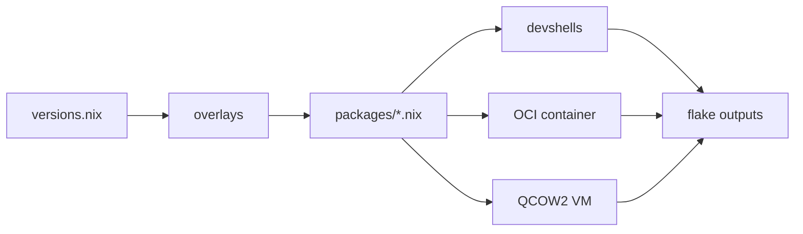
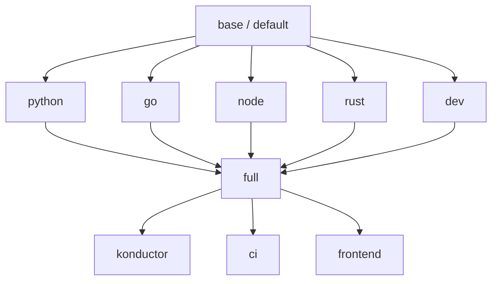
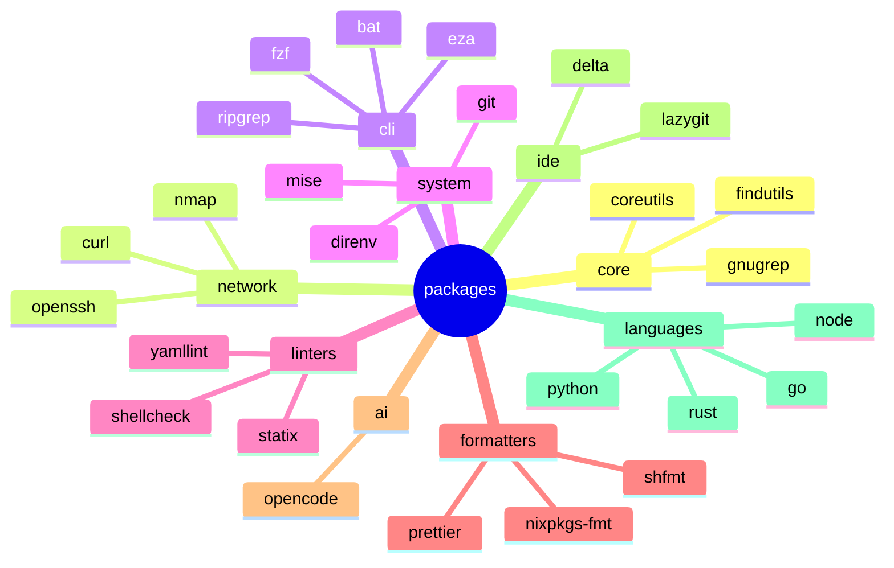
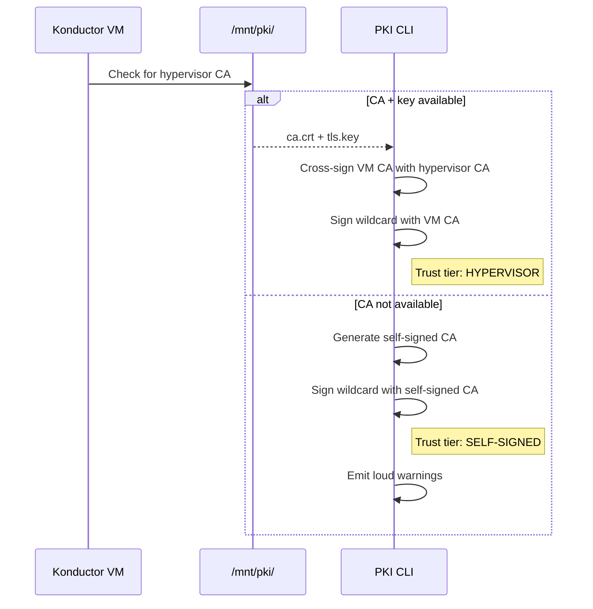

layout: cover color: slate

---

# How much does "works on my machine" cost your team per quarter?

Konductor: one Nix flake, every environment, every target

<!-- HOOK. Don't introduce yourself yet — earn their curiosity first. Ask the question, let it hang. The cost is real: onboarding delays, irreproducible incidents, CI/CD drift. Pause 3 seconds, then advance. ~15 seconds. -->

---

## src: ../../shared/fragments/intro.md

---

layout: statement color: cream

---

# Six months in, no two developer machines have the same tool versions.

<!-- Let this land. This is the core problem statement. The audience who has lived this will nod. The audience who hasn't will be curious. Don't elaborate — the whitespace IS the emphasis. ~5 seconds, then advance. -->

---

layout: fact color: cream

---

# 2–5 days

Average new-hire onboarding before writing code

<template #context> Industry surveys, 2023–2025 engineering productivity reports </template>

<!-- Anchor the problem with a number. Two to five days of engineering time burned on environment setup for every new hire. Multiply by your hiring rate and your average engineering salary. That's real money. ~10 seconds. -->

---

layout: two-cols-title color: cream columns: 1fr 1fr

---

# Environment entropy has four root causes

::left::

<v-clicks>

- **Toolchain divergence** — Python 3.11 vs 3.13, Go 1.22 vs 1.24
- **PKI fragmentation** — every team rolls their own certificate story

</v-clicks>

::right::

<v-clicks>

- **Configuration drift** — linter configs in dotfiles diverge silently
- **Onboarding friction** — 47-step wiki pages nobody maintains

</v-clicks>

<!-- Walk through each one. Toolchain divergence means CI catches bugs your local misses. PKI fragmentation means internal services need different trust configs per team. Config drift means two developers get different lint results. Onboarding wikis are always six months stale. These compound on each other. ~45 seconds. -->

---

layout: default color: cream

---

# The cost compounds silently across the organization

<div class="flex gap-4 mt-6 justify-center">
  <MetricCard value="2-5 days" label="Onboarding Time" icon="i-carbon-time" color="peach" />
  <MetricCard value="$$$" label="Cannot Reproduce" icon="i-carbon-warning-alt" color="peach" />
  <MetricCard value="∞" label="Drift Vectors" icon="i-carbon-misuse-outline" color="peach" />
</div>

<v-click>

<Admonition type="danger" title="The real cost">
"Cannot reproduce" is the most expensive sentence in an incident postmortem.
</Admonition>

</v-click>

<!-- Three metrics that frame the problem. Onboarding is measurable. Incident cost is harder to quantify but immense. Drift vectors are infinite — every tool, every config, every PATH entry can diverge. Then hit the admonition for the emotional anchor. ~30 seconds. -->

---

layout: quote color: cream

---

> "The only way to eliminate environment drift is to make environments deterministic."

— The Nix thesis, paraphrased

<!-- Transition from problem to thesis. This quote sets up the solution. ~5 seconds. -->

---

layout: statement color: cream

---

# The answer is deterministic environments from a single source of truth.

<!-- This is the thesis. One sentence. Maximum whitespace. The audience should feel the gear shift from problem to solution. ~5 seconds. -->

---

layout: section color: slate transition: aurora-zoom sectionNumber: 1

---

# The Workspace Convention

Organizing code before organizing tools

<!-- SECTION BREAK — gear shift. Before we talk Nix, solve the simpler problem first. Where do repos live? Path conventions determine whether scripts are portable and whether pairs can find code. ~5 seconds. -->

---

layout: default color: cream

---

# Path collisions are the first symptom of workspace entropy

<v-clicks>

- `~/projects/app` — whose projects? which app?
- `~/code/backend` — from which git server?
- `~/work/infra` — which organization's infra?

</v-clicks>

Every engineer invents their own convention. When you pair, you cannot find anything.

<!-- Three real examples from real teams. Every engineer picks a different root. Multiple git servers create name collisions. Two repos called "infra" from two orgs. Scripts break on every other machine. ~30 seconds. -->

---

layout: fact color: cream

---

# `/workspace/<user>/<git-server>/<namespace>/`

Four segments. Zero collisions.

<template #context> Inspired by Go's GOPATH, generalized to any server </template>

<!-- The convention in one line. The path encodes user, server, namespace. Collision is structurally impossible. This is a filesystem convention, not a tool — mkdir and git clone. ~15 seconds. -->

---

layout: full color: cream

---

# A real workspace proves the convention works

```bash
/workspace/usrbinkat/git.braincraft.io/braincraft/
├── k9/                  # Konductor Nix flake
├── infrastructure/      # Pulumi IaC
├── blog.usrbinkat.io/   # Hugo blog
└── presentations/       # This slide deck

/workspace/usrbinkat/github.com/containercraft/
├── konductor/           # No collision with braincraft/k9
└── devcontainer/        # Different server, different namespace
```

<Admonition type="tip" title="Key property">
The clone URL is derivable from the filesystem path. The path IS the address.
</Admonition>

<!-- This is my actual workspace. Under braincraft, six sibling projects. Under containercraft on GitHub, different repos from a different server. No collisions. The path itself is a unique identifier. ~20 seconds. -->

---

layout: section color: slate transition: aurora-zoom sectionNumber: 2

---

# Konductor Architecture

A Nix flake as the universal developer environment

<!-- SECTION BREAK. Now we get to the core. Konductor is a single flake that produces devshells, OCI containers, and VM images from one set of package definitions. ~5 seconds. -->

---

layout: default color: cream

---

# One flake orchestrates all targets from a single source of truth



<v-clicks>

- `versions.nix` — Python 3.13, Go 1.24, Node 22, Rust 1.92.0
- `packages/` — 13 categories composed by purpose
- `devshells/` — layers built on a shared base

</v-clicks>

<!-- Data flow diagram. Everything starts at versions.nix — a pure data file. Change a version in one place, every target rebuilds. No Dockerfile to update, no CI config to change, no wiki to edit. ~30 seconds. -->

---

layout: full color: cream

---

# Flake inputs pin every dependency to an exact revision

````md magic-move {lines: true}
```nix
# Minimal flake — just nixpkgs
inputs = {
  nixpkgs.url = "github:NixOS/nixpkgs/nixos-25.11";
};
```

```nix
# Add language overlays and tooling
inputs = {
  nixpkgs.url = "github:NixOS/nixpkgs/nixos-25.11";
  nixpkgs-unstable.url = "github:NixOS/nixpkgs/nixpkgs-unstable";
  rust-overlay.url = "github:oxalica/rust-overlay";
  nixvim.url = "github:nix-community/nixvim/nixos-25.11";
};
```

```nix
# Full production inputs — 13 total
inputs = {
  nixpkgs.url = "github:NixOS/nixpkgs/nixos-25.11";
  nixpkgs-unstable.url = "github:NixOS/nixpkgs/nixpkgs-unstable";
  rust-overlay.url = "github:oxalica/rust-overlay";
  nixvim.url = "github:nix-community/nixvim/nixos-25.11";
  home-manager.url = "github:nix-community/home-manager/release-25.11";
  nix2container.url = "git+https://github.com/nlewo/nix2container";
  catppuccin.url = "github:catppuccin/nix";
};
```
````

`flake.lock` is your software bill of materials.

<!-- Magic Move shows the flake growing from one input to thirteen. Unlike Dockerfile :latest, every input locks to a specific git commit. Reproducible months or years later. flake.lock is your SBOM. ~30 seconds. -->

---

layout: default color: cream

---

# Devshells compose like inheritance — base, then layers



<!-- Composition pattern. Base shell has coreutils, git, linters, formatters — no language opinions. Language shells add runtimes. Dev adds Neovim and tmux. Full combines everything. Each layer uses overrideAttrs to extend — not replace. ~20 seconds. -->

---

layout: full color: cream

---

# base.nix defines the foundation for every environment

```nix
# src/devshells/base.nix — 80 lines that set up everything
pkgs.mkShell {
  name = "default";
  packages = packages.default;  # from src/packages/default.nix # [!code highlight]

  shellHook = ''
    # Source bash-completion
    source "${pkgs.bash-completion}/share/bash-completion/bash_completion"
    # Source hermetic bashrc (aliases, shell options)
    ${bashrcContent}
  '';

  env = import ../lib/env.nix // packages.env // {
    KONDUCTOR_SHELL = "default"; # [!code highlight]
    SHELL = "${pkgs.bashInteractive}/bin/bash";
  };
}
```

<!-- Actual base.nix, simplified. mkShell takes packages from single source of truth, shellHook for completions and aliases, environment variables. Every other shell extends this with overrideAttrs. ~20 seconds. -->

---

layout: two-cols-title color: cream columns: 1fr 1fr

---

# Cross-platform shells

::left::

<v-clicks>

- `default` — core tools, no languages
- `python` — Python 3.13 + uv + ruff
- `go` — Go 1.24 + gopls + delve
- `node` — Node 22 + pnpm + biome
- `rust` — Rust 1.92.0 + cargo + clippy
- `dev` — Neovim + tmux + lazygit
- `full` — all of the above

</v-clicks>

::right::

### Linux-only shells

<v-clicks>

- `konductor` — full + Docker + QEMU + libvirt
- `ci` — full + Forgejo runner
- `frontend` — full + Playwright browsers

</v-clicks>

```nix
# flake.nix — conditional export
devShells = { inherit (devshells)
    default python go node rust dev full;
} // lib.optionalAttrs
    (system == "x86_64-linux")
    { inherit (devshells) konductor ci; };
```

<!-- Seven shells work on both Linux and macOS. Three are Linux-only because they need KVM or X11. The flake uses optionalAttrs for clean conditionals — no ifdef spaghetti. ~30 seconds. -->

---

layout: section color: slate transition: aurora-zoom sectionNumber: 3

---

# Package Taxonomy

13 categories compose into purpose-built environments

<!-- SECTION BREAK. How packages are organized. Not one flat list — 13 categories by engineering concern. Trivial to audit, add, or remove entire categories. ~5 seconds. -->

---

layout: default color: cream

---

# Package categories map to engineering concerns



<!-- Each category is a separate Nix file. Core gives Unix essentials. CLI gives modern replacements. Linters and formatters are wrapped with hermetic config files. Reason about your environment by category, not by scrolling a flat list. ~20 seconds. -->

---

layout: full color: cream

---

# The default set covers any workflow without language opinions

```nix
# src/packages/default.nix
default = aliasWrappersPackage
  ++ corePackages      # ls, cat, grep, sed, awk, tar # [!code highlight]
  ++ networkPackages   # curl, openssh, nmap, dig
  ++ systemPackages    # git, direnv, mise, nix tools
  ++ cliPackages       # bat, eza, ripgrep, fzf, jq, yq
  ++ lintersPackages   # statix, shellcheck, yamllint, hadolint # [!code highlight]
  ++ formattersPackages # nixpkgs-fmt, shfmt, prettier, taplo
  ++ aiPackages;       # opencode, AI coding assistants
```

<v-clicks>

- No Python, no Go, no Node, no Rust in the base
- Language runtimes compose at the devshell level
- Alias wrappers first in PATH for `k` (kubectl), `ll`, `la`

</v-clicks>

<!-- The default package set is what every environment gets. Everything an engineer needs to navigate a codebase, lint, format, and work with git — but zero language runtimes. Languages are added at the devshell level. Small, fast, language-agnostic. ~20 seconds. -->

---

layout: two-cols-title color: cream columns: 1fr 1fr

---

# Language packages compose additively

::left::

**Python 3.13**

<v-clicks>

- `python313` + `uv`
- `ruff` + `mypy` + `bandit`
- `pyright` (LSP)

</v-clicks>

**Go 1.24**

<v-clicks>

- `go_1_24` + `gopls`
- `delve` + `golangci-lint`
- `gotools` (goimports)

</v-clicks>

::right::

**Node 22**

<v-clicks>

- `nodejs_22` + `pnpm`
- `biome` + `eslint`
- `typescript`

</v-clicks>

**Rust 1.92.0**

<v-clicks>

- `rust-bin.stable` (via overlay)
- `clippy` + `rustfmt`
- `cargo-edit` + `cargo-watch`

</v-clicks>

<!-- Each language shell adds exactly its runtime and toolchain to the base. Because Nix isolates every package by store path, all four coexist in the full shell. No virtualenvs, no nvm, no rustup. ~30 seconds. -->

---

layout: section color: slate transition: aurora-zoom sectionNumber: 4

---

# Configured Programs

Configure once, get identical tools everywhere

<!-- SECTION BREAK. Beyond packages, Konductor configures programs declaratively. Neovim, tmux, ttyd — not just installed, fully configured as Nix expressions. Config travels with the environment. ~5 seconds. -->

---

layout: full color: cream

---

# NixVim turns Neovim configuration into a Nix expression

```nix
# src/programs/neovim/plugins.nix (excerpt)
plugins = {
  snacks = {
    enable = true;
    settings = {
      bigfile = { enabled = true; size = 1572864; };
      notifier = { enabled = true; timeout = 3000; };
      indent = { enabled = true; animate.enabled = true; };
    };
  };
  telescope = { enable = true; }; # [!code highlight]
  treesitter = { enable = true; }; # [!code highlight]
  lsp = {
    enable = true;
    servers = {
      pyright.enable = true; # [!code highlight]
      gopls.enable = true; # [!code highlight]
      ts_ls.enable = true; # [!code highlight]
      rust_analyzer.enable = true; # [!code highlight]
    };
  };
};
```

<!-- Real code from Konductor's Neovim config. Every plugin, keybinding, LSP server is a Nix expression. NixVim compiles this into a fully configured Neovim package. No init.lua, no lazy.nvim bootstrap, no PackerSync. Deterministic editor config. ~20 seconds. -->

---

layout: default color: cream

---

# tmux gets Catppuccin theming and which-key navigation

<v-clicks>

- Catppuccin Frappe theme applied declaratively via Nix
- Custom `which-key.yaml` maps every prefix to a discoverable menu
- Prefix bindings identical across devshell, container, and VM
- Session management: detach, reattach, persist across SSH drops

</v-clicks>

```yaml
# src/programs/tmux/which-key.yaml (excerpt)
root:
  - key: "c"  command: "new-window"      name: "new window"
  - key: "|"  command: "split-window -h" name: "split right"
  - key: "-"  command: "split-window -v" name: "split below"
```

<!-- tmux config as a Nix expression. Catppuccin Frappe theme, which-key popup shows all bindings — no memorization. Same config in devshell, OCI container, and KubeVirt VM. ~20 seconds. -->

---

layout: two-cols-title color: cream columns: 1fr 1fr

---

# ttyd and ghostty-web serve terminals over HTTP

::left::

**ttyd** (battle-tested)

<v-clicks>

- C-based web terminal server
- Catppuccin Frappe color scheme
- WebSocket protocol over HTTPS
- Used in KubeVirt VMs behind Envoy

</v-clicks>

::right::

**ghostty-web** (experimental)

<v-clicks>

- Node.js + Express + xterm.js
- Same color scheme as ttyd
- Lighter weight for dev use
- Feature-flagged in Konductor

</v-clicks>

<!-- Two programs solving the same problem differently — terminal over HTTP. ttyd is production: C, efficient WebSocket, runs behind Envoy with TLS. ghostty-web is experimental: Node.js, lighter. Both get the same Catppuccin scheme from Nix. ~25 seconds. -->

---

layout: full color: cream

---

# Hermetic linter configs travel with the shell

<CodeComparison beforeLabel="shellcheck" afterLabel="prettier">

```nix
# src/config/linters/shellcheck/default.nix
pkgs.writeShellScriptBin "shellcheck" ''
  exec ${pkgs.shellcheck}/bin/shellcheck \
    --rcfile=${./. + "/.shellcheckrc"} \ # [!code highlight]
    "$@"
''
```

<template #after>

```nix
# src/config/formatters/prettier/default.nix
pkgs.writeShellScriptBin "prettier" ''
  exec ${pkgs.nodePackages.prettier}/bin/prettier \
    --config ${./. + "/.prettierrc.yaml"} \ # [!code highlight]
    "$@"
''
```

</template>

</CodeComparison>

<Admonition type="tip" title="Key insight">
The config file path is a /nix/store path — immutable, reproducible, identical on every machine.
</Admonition>

<!-- The wrapper pattern. Instead of shipping shellcheck and hoping for the right .shellcheckrc, we wrap the binary with a script that injects the config from the Nix store. The path is a /nix/store hash — cannot be modified, cannot drift. We do this for every linter and formatter. ~25 seconds. -->

---

layout: section color: slate transition: aurora-zoom sectionNumber: 5

---

# PKI Trust Chain

Certificates generated, validated, and trusted automatically

<!-- SECTION BREAK. The part nobody wants to deal with. If you run internal services with TLS, every developer machine needs to trust your certificates. Konductor automates this entirely. ~5 seconds. -->

---

layout: default color: cream

---

# A Python CLI generates certificates with provenance tracking

<v-clicks>

- **CA key**: P-384 elliptic curve (NIST-recommended)
- **Leaf key**: P-256 for wildcard `*.konductor.arpa`
- **Provenance**: git commit, nix derivation, build host baked into x509 extensions
- **Trust tiers**: hypervisor cross-sign or self-sign (automatic detection)

</v-clicks>

```bash
python3 -m pki generate   # Idempotent CA + wildcard cert
python3 -m pki bundle     # Build trust bundle
python3 -m pki trust      # Install to system trust store
python3 -m pki status     # Full PKI state summary
```

<!-- PKI module is a Python CLI using the cryptography library. P-384 CA, P-256 wildcard leaf. Provenance tracking — every certificate carries the git commit and nix derivation hash in custom x509 OID extensions. Trace any certificate back to its exact source. ~30 seconds. -->

---

layout: default color: cream

---

# Trust tiers determine certificate authority automatically



<!-- On boot, the PKI system checks for a hypervisor CA at /mnt/pki. If present, the VM's CA is cross-signed creating a proper trust chain. If not, it falls back to self-signed with loud warnings. Degraded PKI must be impossible to ignore. ~25 seconds. -->

---

layout: full color: cream

---

# The trust bundle propagates to every tool that needs TLS

```bash
# /etc/profile.d/konductor-ca.sh (auto-generated by pki trust)
export SSL_CERT_FILE="/etc/konductor/pki/ca-bundle.crt" # [!code highlight]
export NIX_SSL_CERT_FILE="/etc/konductor/pki/ca-bundle.crt" # [!code highlight]
export CURL_CA_BUNDLE="/etc/konductor/pki/ca-bundle.crt" # [!code highlight]
export REQUESTS_CA_BUNDLE="/etc/konductor/pki/ca-bundle.crt" # [!code highlight]
export NODE_EXTRA_CA_CERTS="/etc/konductor/pki/ca-bundle.crt" # [!code highlight]
export GIT_SSL_CAINFO="/etc/konductor/pki/ca-bundle.crt" # [!code highlight]
```

```bash
# Docker registry trust via symlink
/etc/docker/certs.d/registry.ucs.arpa/ca.crt → /etc/konductor/pki/ca-bundle.crt
```

<!-- One trust bundle file, six environment variables, Docker registry symlinks. After pki trust, every tool — curl, git, Python requests, Node.js, Nix itself — trusts the same CAs. Internal container registry works without --insecure-registry. One command, total trust propagation. ~20 seconds. -->

---

layout: fact color: cream

---

# 6

Environment variables. One trust bundle. Total TLS coverage.

<template #context> curl, git, Python, Node.js, Nix, Docker — all trust the same CAs </template>

<!-- Punctuate the PKI section with a fact slide. Six variables, one file, every tool. The simplicity of the solution contrasts with the complexity of the problem. ~5 seconds. -->

---

layout: section color: slate transition: aurora-zoom sectionNumber: 6

---

# Deployment Targets

One flake, four deployment surfaces

<!-- SECTION BREAK. Everything we've discussed feeds into four deployment targets. The same Nix expressions build your devshell, OCI containers, QCOW2 VMs, and NixOS modules. ~5 seconds. -->

---

layout: default color: cream

---

# OCI containers use nix2container for layer-optimized images

<v-clicks>

- **nix2container** — not dockerTools, not Dockerfile
- Layers map to nix store paths — deduplication by content hash
- Reproducible image digest — same inputs always produce same image
- No Docker daemon required during build

</v-clicks>

```nix
# src/oci/default.nix (simplified)
nix2container.buildImage {
  name = "ghcr.io/braincraftio/konductor";
  config = {
    entrypoint = [ "${pkgs.bashInteractive}/bin/bash" ];
    env = [ "SSL_CERT_FILE=/etc/konductor/pki/ca-bundle.crt" ]; # [!code highlight]
  };
  layers = [ /* packages.default ++ programs */ ];
}
```

<!-- OCI build uses nix2container. Each layer corresponds to store paths, so only affected layers rebuild. Deterministic digest — build today and in six months, same hash. Impossible with Dockerfile where apt-get update produces different results daily. ~25 seconds. -->

---

layout: two-cols-title color: cream columns: 1fr 1fr

---

# QCOW2 images become KubeVirt golden images

::left::

**Build pipeline**

<v-clicks>

- `nix build .#qcow2` — full NixOS system
- Cloud-init for user data injection
- Konductor devshell pre-installed
- PKI trust chain bootstrapped at boot

</v-clicks>

::right::

**Deploy pipeline**

<v-clicks>

- Upload QCOW2 to container registry as OCI artifact
- KubeVirt DataVolume imports from registry
- VolumeSnapshot creates golden image
- VirtualMachine clones from snapshot

</v-clicks>

<!-- QCOW2 build produces a complete NixOS VM with Konductor pre-installed. Cloud-init handles first-boot. Image goes to container registry as OCI artifact, KubeVirt imports as DataVolume, VolumeSnapshot creates golden image, new VMs clone in seconds. ~30 seconds. -->

---

layout: full color: cream

---

# KubeVirt VMs get the same environment as local devshells

```yaml
# deploy/kubevirt/base/konductor.yaml (simplified)
apiVersion: kubevirt.io/v1
kind: VirtualMachine
spec:
  template:
    spec:
      domain:
        resources:
          requests: { memory: '8Gi', cpu: '4' } # [!code highlight]
        devices:
          disks:
            - name: rootdisk
              disk: { bus: virtio }
      volumes:
        - name: rootdisk
          dataVolume:
            name: konductor-golden-dv # [!code highlight]
```

```bash
# Access via ttyd in browser or SSH
ssh -p 2222 usrbinkat@konductor-vm.namespace.svc
```

<!-- Kustomize base defines the VirtualMachine. Overlays add per-instance customization — persistent home directories, network attachments, proxy config. VM runs ttyd behind Envoy Gateway for browser access. Same Neovim, tmux, language runtimes, PKI trust chain as local nix develop. ~20 seconds. -->

---

layout: section color: slate transition: aurora-zoom sectionNumber: 7

---

# The Payoff

What reproducibility enables

<!-- SECTION BREAK. Final arc. Everything we've built — devshells, packages, programs, PKI, OCI, VM — what does it actually give you? ~5 seconds. -->

---

layout: default color: cream

---

# Reproducibility is the foundation of everything else

<v-clicks>

- **Onboarding**: minutes, not days — `nix develop` on day one
- **Incidents**: reproduce in an identical environment, always
- **CI/CD parity**: developers and pipelines use the same tools at the same versions
- **Auditing**: flake.lock + PKI provenance = full supply chain traceability

</v-clicks>

<!-- The real payoff isn't any single feature. It's what reproducibility enables. New hire onboarding in ten minutes. Incident debugging in identical environments. CI/CD parity by definition. Full supply chain traceability from source to deployed certificate. When every environment is identical, entire categories of problems disappear. ~30 seconds. -->

---

layout: fact color: cream

---

# 10 minutes

From `git clone` to fully productive developer environment

<template #context> Down from 2–5 days — a 99% reduction in onboarding time </template>

<!-- Callback to the opening metric. We started at 2-5 days. We're at 10 minutes. That's a 99% reduction. Let the number do the work. ~10 seconds. -->

---

layout: two-cols-title color: cream columns: 1fr 1fr leftColor: peach rightColor: mint

---

# Before Konductor vs. After Konductor

::left::

### Before

<v-clicks>

- 2-5 day onboarding
- "Cannot reproduce" incidents
- 47-step setup wikis
- Per-team PKI hacks
- CI ≠ local environment

</v-clicks>

::right::

### After

<v-clicks>

- 10-minute onboarding
- Identical environments everywhere
- `nix develop` — one command
- Automated PKI trust chain
- CI = local, by definition

</v-clicks>

<!-- Side-by-side summary. peach for before (problem), mint for after (solution). Accent color on the column cards only — the canvas stays neutral. ~20 seconds. -->

---

layout: center color: cream

---

# `nix develop .#full`

### One command. Every tool. Every config. Every language.

```bash
$ nix develop .#full

╔══════════════════════════════════════════════════════════════╗
║                    Konductor DevShell                        ║
╚══════════════════════════════════════════════════════════════╝

$ python3 --version && go version && node --version && rustc --version
Python 3.13   Go 1.24   v22   rustc 1.92.0
```

<!-- If time allows, do a live demo. Type nix develop, watch the store populate. Python, Go, Node, Rust, Neovim, tmux, 20+ linters, all configured identically. One command replaces your entire setup process. ~15 seconds or live demo time. -->

---

layout: default color: cream

---

# Start here: fork and run `nix develop`

<div class="flex gap-6 mt-4 justify-center">
  <QRCode url="https://github.com/containercraft/konductor" label="Konductor" :size="150" />
  <QRCode url="https://git.braincraft.io" label="Braincraft" :size="150" />
</div>

<v-click>

```bash
git clone https://github.com/containercraft/konductor k9
cd k9
nix develop
```

</v-click>

<!-- The repository is open source. Fork it, clone into your workspace convention path, run nix develop. Customize versions.nix, add or remove categories, configure Neovim. The architecture is designed to be forked. ~15 seconds. -->

---

layout: statement color: cream

---

# Your development environment is a product. Ship it like one.

<!-- Final thesis. Callback to the opening: "works on my machine" costs real money. The answer: treat your environment as a product with deterministic builds, version control, and CI. Ship it like one. ~5 seconds. -->

---

## src: ../../shared/fragments/thanks.md
