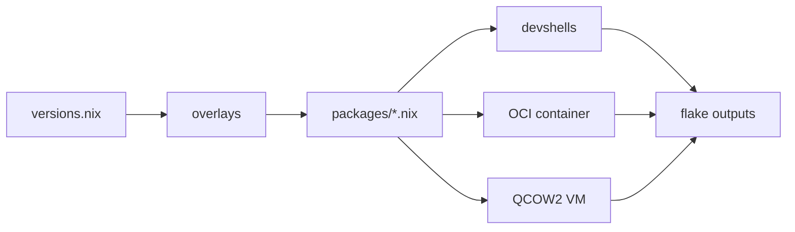
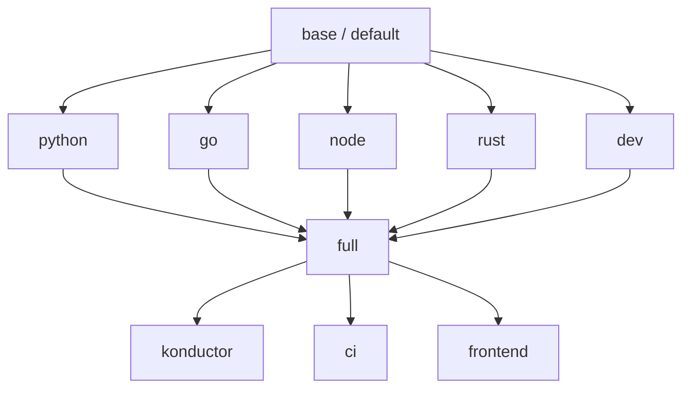
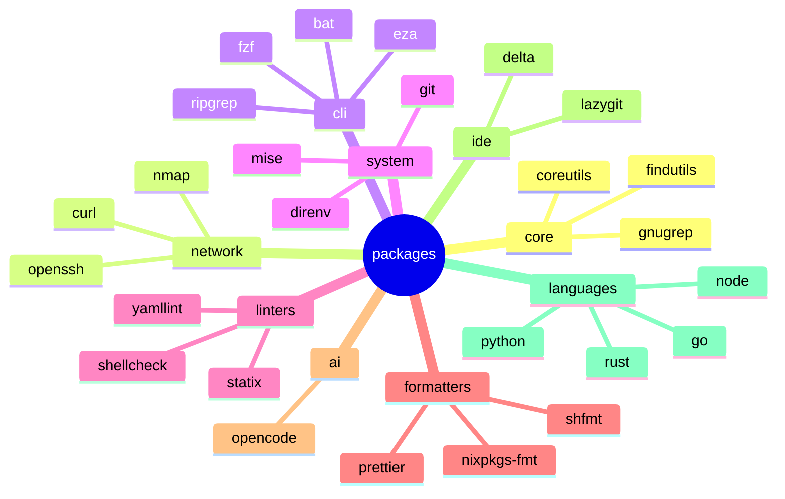
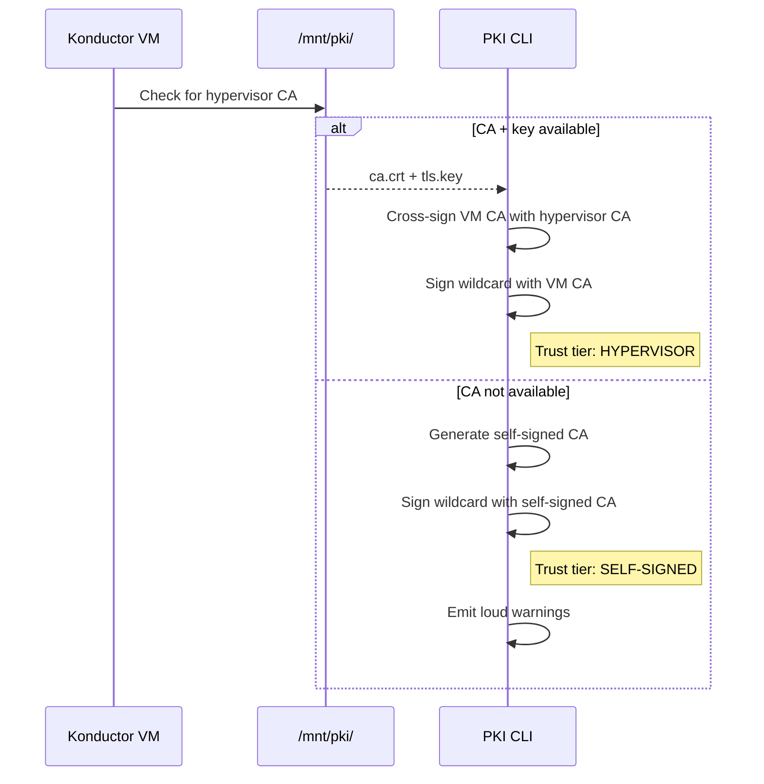

---
layout: cover
---

# Konductor

## Reproducible Developer Environments with Nix Flakes

**usrbinkat** | Braincraft

<!--
Welcome everyone. I'm usrbinkat, and today I'm going to show you how we eliminated "works on my machine" from our entire workflow. Not with containers alone, not with dotfiles, but with a single Nix flake that produces devshells, OCI images, and virtual machines from one source of truth. By the end of this talk, you'll have a repo you can fork and run `nix develop` to get a complete, reproducible environment in seconds.
-->

---
src: ../../shared/fragments/intro.md
---

---
layout: default
---

# "It works on my machine" costs real money

<v-clicks>

- **Onboarding**: New hires spend 2-5 days setting up toolchains before writing code
- **Incidents**: "Cannot reproduce" is the most expensive sentence in an incident postmortem
- **Drift**: Six months in, no two developer machines have the same tool versions

</v-clicks>

<!--
Let me start with a question: how many hours did your last new hire spend setting up their development environment? Two days? A week? That's real engineering time burned on environment setup instead of shipping features. And it gets worse — when an incident happens and you cannot reproduce it locally because your environment has drifted from production, that's when the real cost hits. Environment entropy is not a minor annoyance; it's a systemic tax on your entire engineering organization.
-->

---
layout: two-cols
---

# Environment entropy has four root causes

<v-clicks>

- **Toolchain divergence** — Python 3.11 vs 3.13, Go 1.22 vs 1.24
- **PKI fragmentation** — every team rolls their own certificate story

</v-clicks>

::right::

<v-clicks>

- **Configuration drift** — linter configs in dotfiles diverge silently
- **Onboarding friction** — 47-step wiki pages nobody maintains

</v-clicks>

<!--
These four problems compound on each other. Toolchain divergence means your CI catches bugs your local environment misses. PKI fragmentation means internal services require different trust configurations per team. Configuration drift means two developers get different linter results on the same code. And onboarding friction means the wiki is always wrong because the last person to set up their machine did it six months ago. You cannot fix these one at a time — you need a systemic solution.
-->

---
layout: center
---

# The answer is deterministic environments from a single source of truth

<br>

### Nix flakes deliver exactly this.

<!--
This is the thesis of the talk. A deterministic environment means every developer, every CI runner, every VM gets identical tools at identical versions from a single definition. Nix flakes are the mechanism. Let me show you how we built this, starting with the simplest problem first — where your code lives on disk.
-->

---
layout: section
---

# The Workspace Convention

Organizing code before organizing tools

<!--
Before we talk about Nix, we need to solve a simpler problem. Where do your repositories live? This sounds trivial, but path conventions determine whether your team can pair effectively, whether your scripts are portable, and whether your tooling can make assumptions about project locations.
-->

---
layout: default
---

# Path collisions are the first symptom of workspace entropy

<v-clicks>

- `~/projects/app` — whose projects? which app?
- `~/code/backend` — from which git server?
- `~/work/infra` — which organization's infra?

</v-clicks>

<br>

Every engineer invents their own convention. When you pair, you cannot find anything.

<!--
I've seen teams where every engineer has a different directory structure. One person uses ~/projects, another uses ~/code, a third uses ~/src. When you pair program or share a script that references a path, it breaks immediately. Worse, if you work across multiple git servers — GitHub, GitLab, a self-hosted Forgejo — you get name collisions. Two different repos both called "infra" from two different organizations end up in the same directory.
-->

---
layout: full
---

# A filesystem convention eliminates collisions across users, servers, and namespaces

```text
/workspace/<user>/<git-server>/<namespace>/
```

```bash
/workspace/usrbinkat/git.braincraft.io/braincraft/
├── k9/                  # Konductor Nix flake
├── infrastructure/      # Pulumi IaC
├── blog.usrbinkat.io/   # Hugo blog
└── presentations/       # This slide deck

/workspace/usrbinkat/github.com/containercraft/
├── konductor/           # No collision with braincraft/k9
└── devcontainer/        # Different server, different namespace
```

<!--
This is the Braincraft workspace convention. The path encodes the user, the git server, and the namespace. It's inspired by Go's original GOPATH convention but generalized to any repository from any server. The key insight is that the path itself is a unique identifier — you can never get a collision between repos from different servers or organizations. And because every user has their own subtree under /workspace, you can have multiple people working on the same machine without stepping on each other.
-->

---
layout: two-cols
---

# Independent repos, organized by convention

<v-clicks>

- No git submodules
- No monorepo tooling
- Each repo is a standalone clone
- `git clone` into the right path

</v-clicks>

::right::

<br>

<v-clicks>

- Multi-player: each user gets `/workspace/<user>/`
- Server-aware: GitHub and Forgejo repos coexist
- Discoverable: `tree -L 3 /workspace/` shows everything
- Scriptable: paths are predictable and greppable

</v-clicks>

<!--
The important thing is what this convention does NOT require. No git submodules — those are a maintenance nightmare. No monorepo tooling like Bazel or Nx. Each repository is completely independent — you clone it into the right path and that's it. The convention gives you discoverability and collision avoidance for free, without any tooling overhead. Your scripts can assume paths. Your pair partner can find your code. And if you work across multiple git servers, every repo has a unique home.
-->

---
layout: section
---

# Konductor Architecture

A Nix flake as the universal developer environment

<!--
Now we get to the core of the talk. Konductor is a single Nix flake that produces devshells for local development, OCI containers for CI, and QCOW2 virtual machine images for cloud workstations — all from one set of package definitions. Let me show you how the data flows through the system.
-->

---
layout: default
---

# One flake orchestrates all targets from a single source of truth



<v-clicks>

- `versions.nix` — Python 3.13, Go 1.24, Node 22, Rust 1.92.0
- `packages/` — 13 categories composed by purpose
- `devshells/` — layers built on a shared base

</v-clicks>

<!--
This is the Konductor data flow. Everything starts at versions.nix — a pure data file with no dependencies that defines every version-locked value. That flows through overlays into package definitions organized by category, then into devshells, OCI images, and VM images. The key insight: change a version in one place, and every target rebuilds with the new version. No Dockerfile to update, no CI config to change, no wiki to edit.
-->

---
layout: full
---

# Flake inputs pin every dependency to an exact revision

```nix
inputs = {
  nixpkgs.url = "github:NixOS/nixpkgs/nixos-25.11";
  nixpkgs-unstable.url = "github:NixOS/nixpkgs/nixpkgs-unstable";
  rust-overlay.url = "github:oxalica/rust-overlay";
  nixvim.url = "github:nix-community/nixvim/nixos-25.11";
  home-manager.url = "github:nix-community/home-manager/release-25.11";
  nix2container.url = "git+https://github.com/nlewo/nix2container";
  catppuccin.url = "github:catppuccin/nix";
};
```

`flake.lock` is your software bill of materials.

<!--
Unlike a Dockerfile that pulls :latest, every flake input is locked to a specific git commit in flake.lock. When you run nix flake update, the lock file records the exact commit hash. This means your build is reproducible months or years later. And flake.lock is effectively a software bill of materials — you can audit exactly which version of every dependency went into your environment.
-->

---
layout: default
---

# Devshells compose like inheritance — base, then layers



<!--
The devshell hierarchy follows a composition pattern. The base shell has coreutils, git, network tools, linters, and formatters — everything a developer needs without any language opinions. Language shells add their specific runtime. Dev adds Neovim and tmux. Full combines everything. Konductor extends full with Docker, QEMU, and libvirt for self-hosting builds. Each layer uses Nix's overrideAttrs to extend the base — not replace it.
-->

---
layout: full
---

# base.nix defines the foundation for every environment

```nix
# src/devshells/base.nix — 80 lines that set up everything
pkgs.mkShell {
  name = "default";
  packages = packages.default;  # from src/packages/default.nix

  shellHook = ''
    # Source bash-completion
    source "${pkgs.bash-completion}/share/bash-completion/bash_completion"
    # Source hermetic bashrc (aliases, shell options)
    ${bashrcContent}
  '';

  env = import ../lib/env.nix // packages.env // {
    KONDUCTOR_SHELL = "default";
    SHELL = "${pkgs.bashInteractive}/bin/bash";
  };
}
```

<!--
This is the actual base.nix — simplified slightly for the slide. mkShell takes a list of packages from the single source of truth, a shellHook that sets up completions and aliases, and environment variables. The env attribute merges centralized environment config with package-specific variables. Every other shell extends this with overrideAttrs, adding packages and shellHook content without replacing the base.
-->

---
layout: two-cols
---

# Cross-platform shells work everywhere

<v-clicks>

- `default` — core tools, no languages
- `python` — Python 3.13 + uv + ruff
- `go` — Go 1.24 + gopls + delve
- `node` — Node 22 + pnpm + biome
- `rust` — Rust 1.92.0 + cargo + clippy
- `dev` — Neovim + tmux + lazygit
- `full` — all of the above

</v-clicks>

::right::

# Linux-only shells add virtualization

<v-clicks>

- `konductor` — full + Docker + QEMU + libvirt
- `ci` — full + Forgejo runner
- `frontend` — full + Playwright browsers

</v-clicks>

<br>

```nix
# flake.nix — conditional export
devShells = { inherit (devshells)
    default python go node rust dev full;
} // lib.optionalAttrs
    (system == "x86_64-linux")
    { inherit (devshells) konductor ci; };
```

<!--
Seven shells work on both Linux and macOS — the same tool versions, the same configurations. Three shells are Linux-only because they require KVM, libvirt, or X11 dependencies that don't exist on macOS. The flake.nix uses optionalAttrs to conditionally export them only on x86_64-linux. This is a clean conditional — no ifdef spaghetti, no platform-specific Dockerfiles.
-->

---
layout: section
---

# Package Taxonomy

13 categories compose into purpose-built environments

<!--
Let's look at how packages are organized. Konductor does not dump 500 packages into one flat list. They're split into 13 categories by engineering concern — core utilities, network tools, AI tooling, language runtimes, and so on. This makes it trivial to audit what goes into each shell and to add or remove entire categories.
-->

---
layout: default
---

# Package categories map to engineering concerns



<!--
Each category is a separate Nix file in src/packages/. Core gives you Unix essentials — coreutils, findutils, grep. Network gives you curl, SSH, and diagnostic tools. CLI gives you modern replacements — bat for cat, eza for ls, ripgrep for grep. Linters and formatters are wrapped with their hermetic configuration files so they work identically everywhere. This organization means you can reason about what's in your environment by category, not by scrolling through a flat package list.
-->

---
layout: full
---

# The default set covers any workflow without language opinions

```nix
# src/packages/default.nix
default = aliasWrappersPackage
  ++ corePackages      # ls, cat, grep, sed, awk, tar
  ++ networkPackages   # curl, openssh, nmap, dig
  ++ systemPackages    # git, direnv, mise, nix tools
  ++ cliPackages       # bat, eza, ripgrep, fzf, jq, yq
  ++ lintersPackages   # statix, shellcheck, yamllint, hadolint
  ++ formattersPackages # nixpkgs-fmt, shfmt, prettier, taplo
  ++ aiPackages;       # opencode, AI coding assistants
```

<v-clicks>

- No Python, no Go, no Node, no Rust in the base
- Language runtimes compose at the devshell level
- Alias wrappers first in PATH for `k` (kubectl), `ll`, `la`

</v-clicks>

<!--
The default package set is what every environment gets — the base devshell, the OCI container, the QCOW2 VM. It has everything an engineer needs to navigate a codebase, lint and format code, and work with git — but zero language runtimes. Languages are added at the devshell level. This means the base is small, fast to build, and language-agnostic. The alias wrappers package is placed first in PATH so that shorthand commands like 'k' for kubectl take priority.
-->

---
layout: two-cols
---

# Language packages compose additively

**Python 3.13**

<v-clicks>

- `python313` + `uv`
- `ruff` + `mypy` + `bandit`
- `pyright` (LSP)

</v-clicks>

**Go 1.24**

<v-clicks>

- `go_1_24` + `gopls`
- `delve` + `golangci-lint`
- `gotools` (goimports)

</v-clicks>

::right::

**Node 22**

<v-clicks>

- `nodejs_22` + `pnpm`
- `biome` + `eslint`
- `typescript`

</v-clicks>

**Rust 1.92.0**

<v-clicks>

- `rust-bin.stable` (via overlay)
- `clippy` + `rustfmt`
- `cargo-edit` + `cargo-watch`

</v-clicks>

<!--
Each language shell adds exactly its runtime and toolchain to the base. Python gets the interpreter, uv for package management, and wrapped linters. Go gets the compiler, gopls for editor integration, and delve for debugging. Because Nix isolates every package by store path, all four language runtimes coexist in the full shell without any conflicts. No virtualenvs, no nvm, no rustup — Nix handles all of it.
-->

---
layout: section
---

# Configured Programs

Configure once, get identical tools everywhere

<!--
Beyond packages, Konductor configures programs declaratively. Neovim, tmux, ttyd — these are not just installed, they're fully configured as Nix expressions. The configuration travels with the environment. No dotfiles repo, no stow scripts, no "did you remember to pull the latest config" conversations.
-->

---
layout: full
---

# NixVim turns Neovim configuration into a Nix expression

```nix
# src/programs/neovim/plugins.nix (excerpt)
plugins = {
  snacks = {
    enable = true;
    settings = {
      bigfile = { enabled = true; size = 1572864; };
      notifier = { enabled = true; timeout = 3000; };
      indent = { enabled = true; animate.enabled = true; };
    };
  };
  telescope = { enable = true; };
  treesitter = { enable = true; };
  lsp = {
    enable = true;
    servers = {
      pyright.enable = true;
      gopls.enable = true;
      ts_ls.enable = true;
      rust_analyzer.enable = true;
    };
  };
};
```

<!--
This is real code from Konductor's Neovim configuration. Every plugin, every keybinding, every LSP server is a Nix expression. NixVim compiles this into a fully configured Neovim package. No init.lua to manage, no lazy.nvim bootstrap, no "run PackerSync after cloning." The editor configuration is a deterministic build output — same plugins, same versions, same keybindings on every machine.
-->

---
layout: default
---

# tmux gets Catppuccin theming and which-key navigation

<v-clicks>

- Catppuccin Frappe theme applied declaratively via Nix
- Custom `which-key.yaml` maps every prefix to a discoverable menu
- Prefix bindings identical across devshell, container, and VM
- Session management: detach, reattach, persist across SSH drops

</v-clicks>

<br>

```yaml
# src/programs/tmux/which-key.yaml (excerpt)
root:
  - key: "c"  command: "new-window"      name: "new window"
  - key: "|"  command: "split-window -h" name: "split right"
  - key: "-"  command: "split-window -v" name: "split below"
```

<!--
The tmux configuration is a Nix expression that sets the Catppuccin Frappe color scheme, configures the status bar, and loads a which-key overlay from a YAML file. The which-key plugin means you press the prefix key and get a popup showing all available bindings — no memorization needed. And because this is a Nix derivation, the same tmux config appears in the local devshell, the OCI container, and the KubeVirt VM.
-->

---
layout: two-cols
---

# ttyd and ghostty-web serve terminals over HTTP

**ttyd** (battle-tested)

<v-clicks>

- C-based web terminal server
- Catppuccin Frappe color scheme
- WebSocket protocol over HTTPS
- Used in KubeVirt VMs behind Envoy

</v-clicks>

::right::

**ghostty-web** (experimental)

<v-clicks>

- Node.js + Express + xterm.js
- Same color scheme as ttyd
- Lighter weight for dev use
- Feature-flagged in Konductor

</v-clicks>

<!--
These two programs solve the same problem differently — exposing a terminal session over HTTP so you can access a development environment from a browser. ttyd is the production choice: it's a C program, handles WebSocket connections efficiently, and is what we run in KubeVirt VMs behind Envoy Gateway with proper TLS. ghostty-web is the experimental alternative using Node.js and xterm.js — lighter to deploy but less battle-tested. Both get the same Catppuccin color scheme from Nix.
-->

---
layout: full
---

# Hermetic linter configs travel with the shell

```nix
# src/config/linters/shellcheck/default.nix
pkgs.writeShellScriptBin "shellcheck" ''
  exec ${pkgs.shellcheck}/bin/shellcheck \
    --rcfile=${./. + "/.shellcheckrc"} \
    "$@"
''
```

```nix
# src/config/formatters/prettier/default.nix
pkgs.writeShellScriptBin "prettier" ''
  exec ${pkgs.nodePackages.prettier}/bin/prettier \
    --config ${./. + "/.prettierrc.yaml"} \
    "$@"
''
```

<Admonition type="tip" title="Key insight">
The config file path is a /nix/store path — immutable, reproducible, identical on every machine.
</Admonition>

<!--
This is the wrapper pattern. Instead of shipping shellcheck and hoping everyone has the right .shellcheckrc, we wrap the binary in a script that injects the config file from the Nix store. The config path is a /nix/store hash — it cannot be modified, it cannot drift, it is identical on every machine. We do this for shellcheck, prettier, eslint, ruff, taplo, yamllint, hadolint — every linter and formatter gets a hermetic wrapper. This is why two developers always get the same lint results.
-->

---
layout: section
---

# PKI Trust Chain

Certificates generated, validated, and trusted automatically

<!--
Now let's talk about the part of developer environments that nobody wants to deal with — PKI. If you run internal services with TLS, every developer machine needs to trust your certificates. Konductor automates this entirely — CA generation, leaf certificates, trust bundle propagation, and Docker registry trust.
-->

---
layout: default
---

# A Python CLI generates certificates with provenance tracking

<v-clicks>

- **CA key**: P-384 elliptic curve (NIST-recommended)
- **Leaf key**: P-256 for wildcard `*.konductor.arpa`
- **Provenance**: git commit, nix derivation, build host baked into x509 extensions
- **Trust tiers**: hypervisor cross-sign or self-sign (automatic detection)

</v-clicks>

```bash
python3 -m pki generate   # Idempotent CA + wildcard cert
python3 -m pki bundle     # Build trust bundle
python3 -m pki trust      # Install to system trust store
python3 -m pki status     # Full PKI state summary
```

<!--
The PKI module is a Python CLI using the cryptography library. It generates a CA certificate with a P-384 key and a wildcard leaf certificate with a P-256 key. What makes this unusual is provenance tracking — every certificate carries the git commit, nix derivation hash, and build host encoded in custom x509 OID extensions. This means you can inspect any certificate and trace it back to the exact source code and build that produced it.
-->

---
layout: default
---

# Trust tiers determine certificate authority automatically



<!--
When a Konductor VM boots, the PKI system checks if the hypervisor has mounted a CA certificate and key at /mnt/pki. If both are present, the VM's CA is cross-signed by the hypervisor CA — this creates a proper trust chain where the platform trusts the VM's certificates automatically. If the hypervisor CA is not available, the system falls back to self-signed certificates with loud warnings on stdout, stderr, and even the console device. The goal is to make degraded PKI impossible to ignore.
-->

---
layout: full
---

# The trust bundle propagates to every tool that needs TLS

```bash
# /etc/profile.d/konductor-ca.sh (auto-generated by pki trust)
export SSL_CERT_FILE="/etc/konductor/pki/ca-bundle.crt"
export NIX_SSL_CERT_FILE="/etc/konductor/pki/ca-bundle.crt"
export CURL_CA_BUNDLE="/etc/konductor/pki/ca-bundle.crt"
export REQUESTS_CA_BUNDLE="/etc/konductor/pki/ca-bundle.crt"
export NODE_EXTRA_CA_CERTS="/etc/konductor/pki/ca-bundle.crt"
export GIT_SSL_CAINFO="/etc/konductor/pki/ca-bundle.crt"
```

```bash
# Docker registry trust via symlink
/etc/docker/certs.d/registry.ucs.arpa/ca.crt → /etc/konductor/pki/ca-bundle.crt
```

<!--
One trust bundle file, six environment variables, and Docker registry symlinks. After running pki trust, every tool — curl, git, Python requests, Node.js, Nix itself — trusts the same set of CAs. The Docker daemon gets per-registry trust via the standard certs.d directory with symlinks back to the bundle. This means your internal container registry works without --insecure-registry flags. One command, total trust propagation.
-->

---
layout: section
---

# Deployment Targets

One flake, four deployment targets

<!--
Everything we've discussed so far — devshells, packages, programs, PKI — feeds into four deployment targets. The same Nix expressions that build your local devshell also build OCI containers, QCOW2 VM images, and NixOS module configurations. Let me show you each one.
-->

---
layout: default
---

# OCI containers use nix2container for layer-optimized images

<v-clicks>

- **nix2container** — not dockerTools, not Dockerfile
- Layers map to nix store paths — deduplication by content hash
- Reproducible image digest — same inputs always produce same image
- No Docker daemon required during build

</v-clicks>

```nix
# src/oci/default.nix (simplified)
nix2container.buildImage {
  name = "ghcr.io/braincraftio/konductor";
  config = {
    entrypoint = [ "${pkgs.bashInteractive}/bin/bash" ];
    env = [ "SSL_CERT_FILE=/etc/konductor/pki/ca-bundle.crt" ];
  };
  layers = [ /* packages.default ++ programs */ ];
}
```

<!--
The OCI build uses nix2container, which produces OCI-compliant images directly from Nix store paths without needing a Docker daemon. Each layer corresponds to a set of store paths, so when you update one package, only the affected layer rebuilds. The image digest is deterministic — build it today and six months from now, same inputs produce the same hash. This is impossible with Dockerfile builds where apt-get update produces different results every day.
-->

---
layout: two-cols
---

# QCOW2 images become KubeVirt golden images

**Build pipeline**

<v-clicks>

- `nix build .#qcow2` — full NixOS system
- Cloud-init for user data injection
- Konductor devshell pre-installed
- PKI trust chain bootstrapped at boot

</v-clicks>

::right::

**Deploy pipeline**

<v-clicks>

- Upload QCOW2 to container registry as OCI artifact
- KubeVirt DataVolume imports from registry
- VolumeSnapshot creates golden image
- VirtualMachine clones from snapshot

</v-clicks>

<!--
The QCOW2 build produces a complete NixOS virtual machine image with the Konductor environment pre-installed. Cloud-init handles first-boot configuration — SSH keys, network setup, user creation. The image gets uploaded to a container registry as an OCI artifact, then KubeVirt imports it as a DataVolume. A VolumeSnapshot creates the golden image, and new VMs clone from that snapshot in seconds. Each developer gets their own VM with persistent workspace storage.
-->

---
layout: full
---

# KubeVirt VMs get the same environment as local devshells

```yaml
# deploy/kubevirt/base/konductor.yaml (simplified)
apiVersion: kubevirt.io/v1
kind: VirtualMachine
spec:
  template:
    spec:
      domain:
        resources:
          requests: { memory: "8Gi", cpu: "4" }
        devices:
          disks:
            - name: rootdisk
              disk: { bus: virtio }
      volumes:
        - name: rootdisk
          dataVolume:
            name: konductor-golden-dv
```

```bash
# Access via ttyd in browser or SSH
ssh -p 2222 usrbinkat@konductor-vm.namespace.svc
```

<!--
The Kustomize base defines a VirtualMachine that boots from the golden DataVolume. Overlays add per-instance customization — persistent home directories, network attachment definitions, proxy configuration. The VM runs ttyd behind Envoy Gateway, so developers access their environment through a browser. Or they SSH in directly. Either way, they get the exact same Neovim, tmux, language runtimes, and PKI trust chain as a local nix develop shell.
-->

---
layout: center
---

# `nix develop .#full`

### One command. Every tool. Every config. Every language.

<br>

```bash
$ nix develop .#full

╔══════════════════════════════════════════════════════════════╗
║                    Konductor DevShell                        ║
╚══════════════════════════════════════════════════════════════╝

$ python3 --version && go version && node --version && rustc --version
Python 3.13   Go 1.24   v22   rustc 1.92.0
```

<!--
If we have time, this is where I'd do a live demo. Type nix develop, watch the Nix store populate, and within seconds you have Python, Go, Node, Rust, Neovim, tmux, 20-plus linters, all configured identically. If we don't have time for a live demo, just know that this one command replaces your entire environment setup process. No brew install, no pip install, no nvm use, no manual configuration. One command, complete environment.
-->

---
layout: default
---

# Reproducibility is the foundation of everything else

<v-clicks>

- **Onboarding**: minutes, not days — `nix develop` on day one
- **Incidents**: reproduce in an identical environment, always
- **CI/CD parity**: developers and pipelines use the same tools at the same versions
- **Auditing**: flake.lock + PKI provenance = full supply chain traceability

</v-clicks>

<!--
The real payoff is not any single feature — it's what reproducibility enables. New hire onboarding becomes a ten-minute exercise instead of a multi-day ordeal. Incident debugging happens in an identical environment to production. CI/CD runs the same linters with the same configs as developer machines. And the combination of flake.lock and PKI provenance gives you full supply chain traceability from source code to deployed certificate. When every environment is identical, entire categories of problems simply disappear.
-->

---
layout: center
---

# Start here: fork k9/ and run nix develop

<br>

### `github.com/containercraft/konductor`

<br>

```bash
git clone https://github.com/containercraft/konductor k9
cd k9
nix develop
```

<!--
The repository is open source. Fork it, clone it into your workspace convention path, and run nix develop. Customize the versions in src/lib/versions.nix, add or remove package categories, configure Neovim to your preferences. The architecture is designed to be forked and adapted — not used as-is. Your team's environment should reflect your team's needs. The Konductor pattern gives you the scaffolding to build that reproducibly.
-->

---
layout: intro
---

# Thank you

**usrbinkat** — Braincraft

<br>

<v-clicks>

- Konductor: `github.com/containercraft/konductor`
- Braincraft: `git.braincraft.io`
- Slides: built with Slidev + slidev-theme-braincraft

</v-clicks>

<br>

### Questions?

<!--
Thank you for your time. The Konductor repo is at github.com/containercraft/konductor. The Braincraft organization hosts the self-hosted Forgejo instance, infrastructure-as-code, and these slides. Everything you saw today is open source and running in production. I'm happy to take questions about Nix flakes, devshell composition, PKI automation, KubeVirt integration, or anything else we covered.
-->

