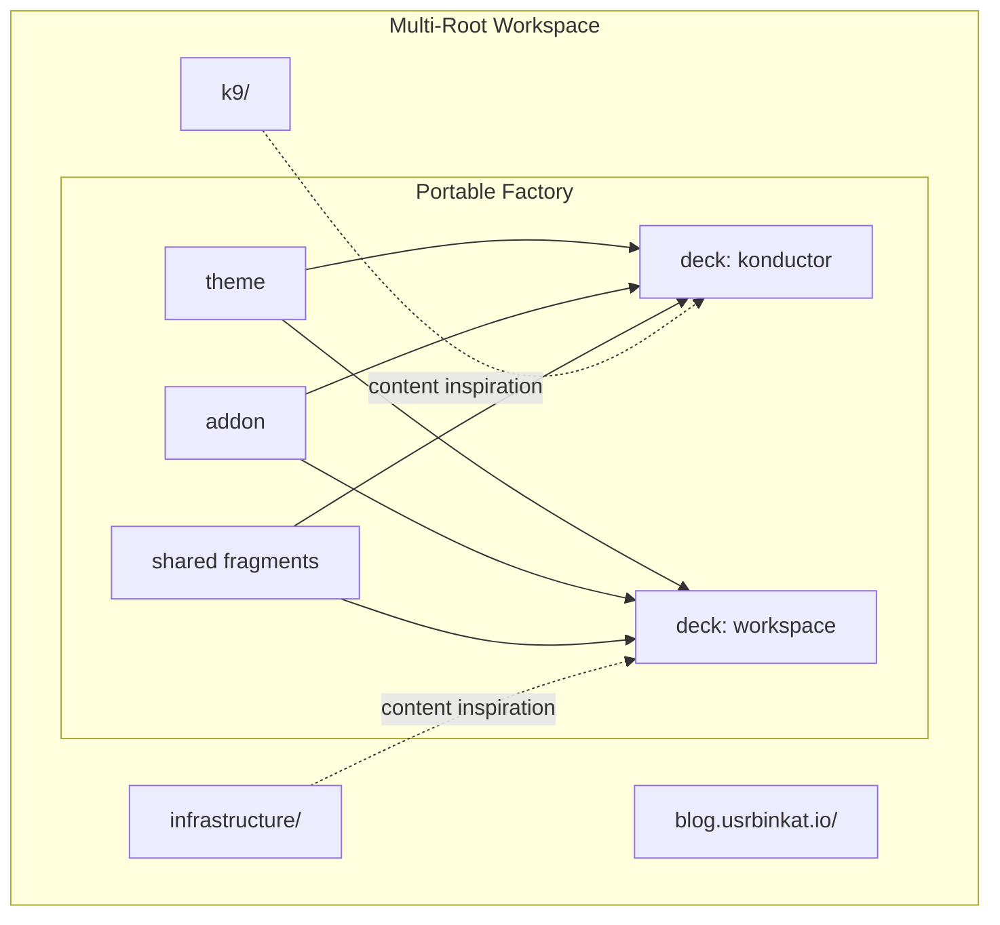

---
layout: cover
color: slate
---

# Where did you clone that repo?

A filesystem convention that eliminates the question entirely

<!--
HOOK. Ask the room: raise your hand if you've searched for a repo you cloned three months ago. Is it in ~/projects? ~/code? ~/work? Every engineer invents their own path convention, and when you pair or share scripts, everything breaks. ~15 seconds.
-->

---

src: ../../shared/fragments/intro.md

---
layout: statement
color: cream
---

# Every engineer invents their own directory convention. Every script breaks on the next machine.

<!--
Let this statement breathe. The audience who has lived this will nod. Whitespace communicates significance — one sentence, maximum impact. ~5 seconds.
-->

---
layout: default
color: cream
---

# Path collisions waste engineering hours every week

<v-clicks>

- `~/projects/app` — whose projects? which app?
- `~/code/infra` — from which git server? which org?
- `~/work/backend` — does this collide with the other backend?
- Scripts hardcode paths that break on every other machine

</v-clicks>

<!--
Four real examples from real teams. Different roots, name collisions across servers, scripts with hardcoded paths. This is a systemic tax, not a minor annoyance. ~30 seconds.
-->

---
layout: fact
color: cream
---

# 47

Steps in the onboarding wiki. Last updated six months ago.

<template #context> Nobody maintains it because everybody improvises </template>

<!--
Anchor the problem with a visceral number. Forty-seven steps in a wiki that's always stale. The audience who has written (or suffered through) one of these will laugh ruefully. ~10 seconds.
-->

---
layout: two-cols-title
color: cream
columns: 1fr 1fr
---

# Monorepo and polyrepo both leave gaps

::left::

<v-clicks>

- **Monorepo**: forces coupling between unrelated projects
- **Monorepo**: CI rebuilds everything on every change
- **Monorepo**: one team's bad commit blocks everyone

</v-clicks>

::right::

<v-clicks>

- **Polyrepo**: no discoverability across projects
- **Polyrepo**: no shared tooling conventions
- **Polyrepo**: "which repo was that in?" is a daily question

</v-clicks>

<!--
The industry debates monorepo vs polyrepo as binary. Monorepos couple unrelated projects. Polyrepos destroy discoverability. Neither handles multiple git servers. Neither handles multiple users on shared VMs. We need a third option. ~30 seconds.
-->

---
layout: section
color: slate
transition: aurora-zoom
sectionNumber: 1
---

# The Workspace Convention

A filesystem convention, not a tool

<!--
SECTION BREAK. Shift from problem to solution. The convention is not a tool, not a package, not an install — it's a naming rule for where you put git clones. ~5 seconds.
-->

---
layout: fact
color: cream
---

# `/workspace/<user>/<git-server>/<namespace>/`

Four segments. Four collision classes eliminated.

<template #context> Inspired by Go's GOPATH, generalized to any server </template>

<!--
The entire convention in one line. /workspace is the consistent root. User segment enables multi-player. Server segment separates GitHub from Forgejo. Namespace maps to org. Collisions are structurally impossible. ~15 seconds.
-->

---
layout: full
color: cream
transition: aurora-slide-up
---

# The real workspace proves the convention works

````md magic-move {lines: true}
```bash
# Every developer's ad-hoc path
~/projects/app
~/code/infra
~/work/backend
```

```bash
# The workspace convention
/workspace/usrbinkat/git.braincraft.io/braincraft/
├── k9/                      # Konductor Nix flake
├── infrastructure/          # Pulumi IaC
├── blog.usrbinkat.io/       # Hugo blog
├── presentations/           # Slidev presentation factory
└── docs/                    # Engineering documentation
```

```bash
# Multiple servers, zero collisions
/workspace/usrbinkat/git.braincraft.io/braincraft/
├── k9/
└── presentations/

/workspace/usrbinkat/github.com/containercraft/
├── konductor/               # No collision with braincraft/k9
└── devcontainer/            # Different server, different namespace
```
````

<!--
Magic Move evolves from chaos to order. Ad-hoc paths, then the convention, then multi-server. The key: the clone URL is derivable from the path. The path IS the address. ~25 seconds.
-->

---
layout: two-cols-title
color: cream
columns: 1fr 1fr
---

# Every path segment earns its place

::left::

### Collision prevention

<v-clicks>

- **`/workspace/`** — consistent root, not `~/projects`
- **`<user>/`** — Alice and Bob on the same VM
- **`<git-server>/`** — GitHub vs Forgejo vs GitLab
- **`<namespace>/`** — org/group separation

</v-clicks>

::right::

### What you get for free

<v-clicks>

- Predictable paths in scripts and docs
- `tree -L 3 /workspace/` shows everything
- `find /workspace -name .envrc` locates all environments
- Zero tooling required — just `mkdir -p`

</v-clicks>

<!--
Break down each segment. /workspace replaces the chaos of ~/projects, ~/code, ~/src. User enables multi-player. Server separates origins. Namespace maps to orgs. The payoff: scripts work everywhere. ~30 seconds.
-->

---
layout: quote
color: cream
---

> "This is not a monorepo. Each repository is an independent git clone with its own lifecycle."

No submodules. No Bazel. No Nx. No Turborepo.

<!--
Clarify what this is NOT. No shared build system, no shared CI, no submodules. Each repo is independent. Delete one without affecting any other. The independence is the point. ~10 seconds.
-->

---
layout: section
color: slate
transition: aurora-zoom
sectionNumber: 2
---

# In Practice

direnv, mise, and environment isolation

<!--
SECTION BREAK. The naming convention is only useful if it integrates with daily workflow. Show how direnv and mise make it automatic. ~5 seconds.
-->

---
layout: full
color: cream
---

# direnv auto-loads environment per directory

```bash
# /workspace/usrbinkat/git.braincraft.io/braincraft/.envrc

export WORKSPACE_ROOT="${WORKSPACE_ROOT:-$PWD}"

# Environment file layering (proxy before network ops)
dotenv .env.docker-dev.example
dotenv_if_exists .env.http_proxy
dotenv_if_exists .env.pulumi
dotenv_if_exists .env

# Nix devshell activation (auto-detects platform)
use flake "${DEVSHELL_FLAKE}#${DEVSHELL_NAME}" # [!code highlight]

# PKI trust bundle propagation
export SSL_CERT_FILE="/etc/konductor/pki/bundle/ca-bundle.crt" # [!code highlight]
export KUBECONFIG="${WORKSPACE_ROOT}/.config/talos/clusters/..."
```

<!--
The actual .envrc. cd into the directory, direnv fires. Loads env files in order — proxy first for network. Activates Nix devshell. Sets PKI trust. Configures KUBECONFIG. cd out, everything unloads. ~25 seconds.
-->

---
layout: default
color: cream
---

# mise orchestrates tasks across the workspace

```toml
# .mise.toml — task automation and cluster config

[settings]
experimental = true
task_output = "prefix"

[env]
WORKSPACE_ROOT = "{{config_root}}"

[vars]
k8s_cluster_name = "docker-dev"
k8s_version = "1.35.0"
talos_version = "v1.12.1"

[task_config]
includes = [ # [!code highlight]
  ".config/mise/toml/talos.compose.toml",
  ".config/mise/toml/pulumi.infrastructure.toml",
  ".config/mise/toml/devcontainer.toml",
]
```

<!--
Mise is the task runner. Tasks operate across sibling repos. Cluster config, versions, network settings. Task definitions split by concern. mise tasks reference siblings because paths are predictable. ~20 seconds.
-->

---
layout: default
color: cream
---

# Environment activation flows automatically

```mermaid
flowchart LR
    CD["cd into workspace"] --> DE["direnv detects .envrc"]
    DE --> ENV["Load .env files"]
    ENV --> NIX["Activate Nix devshell"]
    NIX --> PKI["Set PKI trust bundle"]
    PKI --> K8S["Configure KUBECONFIG"]
    K8S --> RDY["Ready to work"]
    RDY --> OUT["cd out"]
    OUT --> UNL["direnv unloads everything"]
```



<v-clicks>

- No `source activate` scripts to remember
- No `nvm use` or `pyenv shell` commands
- Environment follows directory context automatically

</v-clicks>

<!--
The flow as a diagram. cd in, direnv fires, env files load, Nix activates, PKI sets up, Kubernetes configures, ready. cd out, everything unloads. No stale variables, no leaked PATH entries. ~20 seconds.
-->

---
layout: side-title
color: cream
---

::title::

# Five projects, zero interference

::default::

<v-clicks>

- **k9/** — Nix flake, `nix develop` devshell
- **infrastructure/** — Pulumi Python, `.venv` virtual environment
- **blog.usrbinkat.io/** — Hugo static site, Go toolchain
- **presentations/** — Slidev pnpm workspace, Node.js
- **optiplex-lab/** — YAML configs, no runtime

</v-clicks>

<v-click>

<Admonition type="info" title="Isolation principle">
Python venv from infrastructure/ never leaks into k9/. Node modules from presentations/ never appear in blog/.
</Admonition>

</v-click>

<!--
Look at the diversity of toolchains coexisting. Nix, Python, Go, Node.js, plain YAML. In a monorepo, dependencies would conflict. With the convention and direnv, each has its own isolated environment. ~25 seconds.
-->

---
layout: section
color: slate
transition: aurora-zoom
sectionNumber: 3
---

# The Portable Factory

presentations/ as a self-contained workspace

<!--
SECTION BREAK. Something that surprised even me: the Slidev factory producing these slides is a self-contained pnpm workspace inside the multi-root workspace. It's portable. ~5 seconds.
-->

---
layout: full
color: cream
---

# presentations/ is a self-contained pnpm workspace

```bash
presentations/                          # Portable — drop into any workspace
├── packages/
│   ├── slidev-theme-braincraft/        # Custom theme (15 layouts)
│   └── slidev-addon-braincraft/        # Shared components (9 components)
├── decks/
│   ├── konductor-nix-flake/            # First presentation
│   └── workspace-convention/           # This presentation
├── shared/
│   ├── assets/                         # Logos, photos
│   └── fragments/                      # Reusable slide imports
├── pnpm-workspace.yaml                 # packages/* + decks/*
├── .npmrc                              # shamefully-hoist=true
└── package.json                        # Root workspace scripts
```

<!--
Structure overview. Theme with 15 layouts, addon with 9 components. Individual decks. Shared fragments imported via src:. pnpm workspace. Zero build dependencies on sibling repos. ~20 seconds.
-->

---
layout: two-cols-title
color: cream
leftColor: peach
rightColor: mint
columns: 1fr 1fr
---

# The factory is not married to any project

::left::

**What it references from siblings:**

<v-clicks>

- Source code for content inspiration
- `.envrc` snippets for slide examples
- `.mise.toml` for configuration examples
- Directory trees for diagrams

</v-clicks>

::right::

**What it depends on at build time:**

<v-clicks>

- `pnpm` and `node` (from Nix devshell)
- Its own `packages/` theme and addon
- Its own `shared/` fragments and assets
- Nothing else. Zero sibling dependencies.

</v-clicks>

<!--
The distinction matters. Reads siblings for content. Depends on nothing at build time. Move this entire directory to any workspace and it builds without modification. Portability by design. ~25 seconds.
-->

---
layout: default
color: cream
---

# Factory architecture separates concerns cleanly



<!--
Dotted lines = content inspiration (read siblings to write about them). Solid lines = build dependencies (all internal). Monorepo where monorepo makes sense. Independent clones everywhere else. ~20 seconds.
-->

---
layout: section
color: slate
transition: aurora-zoom
sectionNumber: 4
---

# Developer Experience

Navigation, isolation, and IDE integration

<!--
SECTION BREAK. Convention is only valuable if the daily DX is seamless. Three things: instant navigation, automatic isolation, IDE integration. ~5 seconds.
-->

---
layout: default
color: cream
---

# Navigation is instant with zoxide and direnv

```bash
# Jump to any workspace by partial match
$ z braincraft
→ /workspace/usrbinkat/git.braincraft.io/braincraft/
direnv: loading .envrc
direnv: using flake path:k9#full

# Jump to a sibling project
$ z k9
→ /workspace/usrbinkat/git.braincraft.io/braincraft/k9/

# Jump to a different git server entirely
$ z containercraft
→ /workspace/usrbinkat/github.com/containercraft/
```

<v-clicks>

- `zoxide` learns your navigation patterns
- `direnv` activates/deactivates on every `cd`
- Combined: navigate and environment-switch in one keystroke

</v-clicks>

<!--
zoxide is a smarter cd. Learns frequent directories. Partial match jumps you there. direnv fires on arrival. Combined: navigate and switch environments in one keystroke. No source activate, no nvm use. ~20 seconds.
-->

---
layout: two-cols-title
color: cream
columns: 1fr 1fr
---

# IDE multi-root workspaces match the convention

::left::

```json
// v.code-workspace
{
  "folders": [
    { "path": "k9" },
    { "path": "infrastructure" },
    { "path": "blog.usrbinkat.io" },
    { "path": "presentations" },
    { "path": "optiplex-lab" }
  ],
  "settings": {
    "nix.enableLanguageServer": true,
    "python.defaultInterpreterPath": "./infrastructure/.venv/bin/python"
  }
}
```

::right::

<v-clicks>

- Each folder gets its own language server
- Python LSP for infrastructure/
- Nix LSP for k9/
- TypeScript LSP for presentations/
- One editor window, five project contexts

</v-clicks>

<!--
VS Code multi-root workspace maps perfectly. Each folder gets its own language server, settings, debug config. Full IDE intelligence across five different tech stacks in one editor window. The convention is the filesystem mirror. ~20 seconds.
-->

---
layout: quote
color: cream
---

> "direnv loads and unloads per-directory. Python venv from infrastructure/ never leaks into k9/.
> Node modules from presentations/ never appear in blog/."

Environment isolation by filesystem convention.

<!--
The key property. Isolation enforced by direnv scoping, not containers. Simpler than containers, faster than VMs, works on macOS, Linux, WSL, NixOS. ~10 seconds.
-->

---
layout: section
color: slate
transition: aurora-zoom
sectionNumber: 5
---

# Scaling

Multiple users, multiple servers, CI parity

<!--
SECTION BREAK. What happens when this scales beyond a single developer? Shared machines, CI runners, organizations with dozens of git servers. ~5 seconds.
-->

---
layout: two-cols-title
color: cream
columns: 1fr 1fr
---

# Multiple users share machines without conflict

::left::

```bash
# Alice's workspace
/workspace/alice/
├── github.com/
│   └── acme-corp/
│       ├── frontend/
│       └── api/
└── gitlab.com/
    └── alice-personal/
        └── dotfiles/
```

::right::

```bash
# Bob's workspace
/workspace/bob/
├── github.com/
│   └── acme-corp/
│       ├── frontend/
│       └── api/
└── git.braincraft.io/
    └── braincraft/
        └── k9/
```

<v-clicks>

- Same repos, different user paths — zero collision
- SSH into shared VM, find your workspace at `/workspace/<you>/`
- File permissions align with user boundaries

</v-clicks>

<!--
Alice and Bob both work on acme-corp repos. Their own clones under their own user directories. No collision. Different git servers coexist. File ownership aligns with user directories. ~20 seconds.
-->

---
layout: default
color: cream
---

# Multiple git servers coexist naturally

```bash
/workspace/usrbinkat/
├── github.com/              # Public GitHub
│   ├── containercraft/
│   │   └── konductor/
│   └── NixOS/
│       └── nixpkgs/
├── git.braincraft.io/       # Self-hosted Forgejo
│   └── braincraft/
│       ├── k9/
│       └── infrastructure/
└── gitlab.com/              # GitLab SaaS
    └── client-project/
        └── deployment/
```

<v-clicks>

- Same project name across servers? Different paths.
- `git remote -v` always matches the path you're in
- Clone URL is derivable from the filesystem path

</v-clicks>

<!--
Multi-server story. GitHub, Forgejo, GitLab. Same-name repos on different servers don't collide. Beautiful symmetry: the clone URL is derivable from the path. The path IS the address. ~20 seconds.
-->

---
layout: side-title
color: cream
---

::title::

# CI adopts the same convention

::default::

```bash
# Forgejo CI runner workspace
/workspace/runner/git.braincraft.io/braincraft/
├── k9/
├── infrastructure/
└── presentations/

# GitHub Actions workspace
/workspace/runner/github.com/containercraft/
└── konductor/
```

<v-clicks>

- CI scripts use the same paths as developers
- No `$GITHUB_WORKSPACE` path translation
- Reproduce CI failures locally by cloning to the same path
- Runner user gets `/workspace/runner/`

</v-clicks>

<!--
Convention extends to CI. Runners clone into /workspace/runner/ following the same structure. CI scripts reference paths identically. Reproduce failures locally because paths match. Runner is just another user. ~20 seconds.
-->

---
layout: center
color: cream
---

# Adopt the convention in five minutes

```bash
# 1. Create the root
sudo mkdir -p /workspace && sudo chown $USER /workspace

# 2. Set up your workspace path
mkdir -p /workspace/$USER/github.com/your-org

# 3. Clone into the convention
git clone https://github.com/your-org/your-repo \
  /workspace/$USER/github.com/your-org/your-repo
```

<v-clicks>

- No tools to install (direnv and mise are optional enhancements)
- No configuration files to write
- Just `mkdir -p` and `git clone` into the right path

</v-clicks>

<!--
Three commands. Create /workspace. Create your path hierarchy. Clone into it. No direnv needed. No mise needed. No Nix needed. Just a naming rule. mkdir and git clone. ~15 seconds.
-->

---
layout: fact
color: cream
---

# 3

Commands to adopt. Zero tools to install. Infinite collisions prevented.

<template #context> mkdir, chown, git clone — that's the entire adoption cost </template>

<!--
Punctuate with a number. Three commands. The simplicity is the selling point. ~5 seconds.
-->

---
layout: statement
color: cream
---

# The filesystem is the first API your team shares. Make it collision-free.

<!--
Final thesis. Before you choose a monorepo tool, before you debate submodules, before you write a custom clone script — agree on where code lives. Four path segments. ~10 seconds.
-->

---

src: ../../shared/fragments/thanks.md
