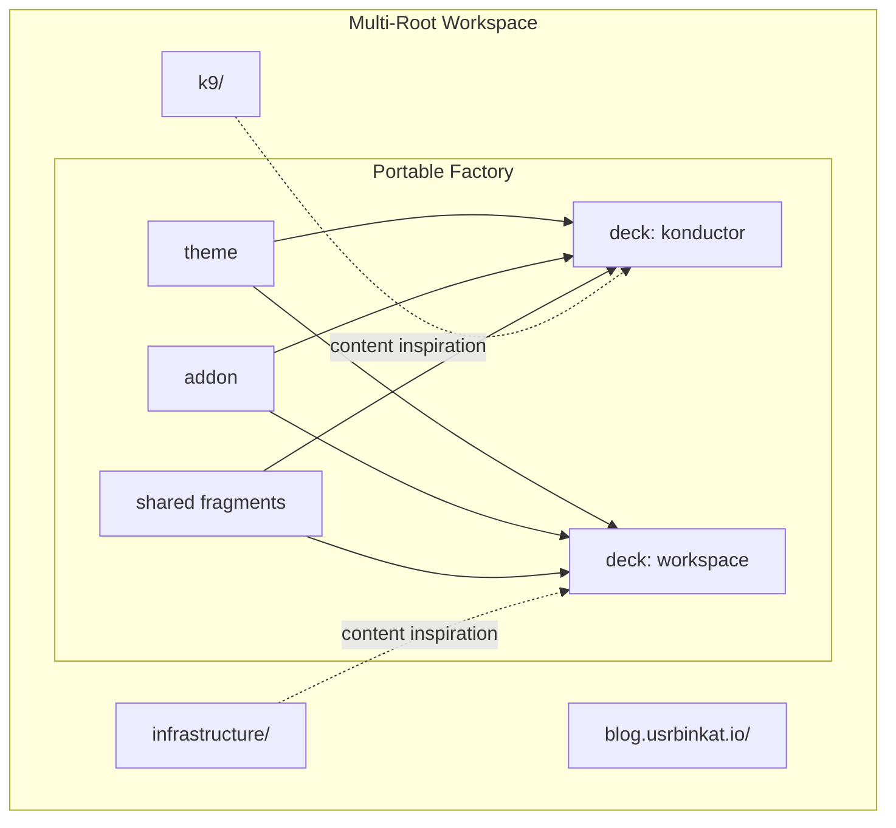

---
layout: cover
color: sky
---

# The Multi-Root Workspace Convention

## Collision-Free Multi-Project Development

**usrbinkat** | Braincraft

<!--
Welcome everyone. Today I'm going to talk about something deceptively simple — where your code lives on disk. This sounds trivial, but the wrong answer costs real engineering hours every week. I'll show you a filesystem convention that eliminates path collisions across users, git servers, and organizations — without any monorepo tooling. By the end, you'll have a convention you can adopt in five minutes with mkdir and git clone.
-->

---
src: ../../shared/fragments/intro.md
---

---
layout: statement
color: peach
---

# "Where did I clone that repo?"

<!--
Raise your hand if you've ever said this. You cloned a repo three months ago, you need it again, and you have no idea where it is. Is it in ~/projects? ~/code? ~/work? ~/src? Every engineer invents their own convention, and when you pair with someone or share a script, everything breaks because paths are different. This is not a minor annoyance — it's a systemic tax on your team.
-->

---
layout: default
color: lavender
---

# Path collisions waste engineering hours every week

<v-clicks>

- `~/projects/app` — whose projects? which app?
- `~/code/infra` — from which git server? which org?
- `~/work/backend` — does this collide with the other backend?
- Scripts hardcode paths that break on every other machine

</v-clicks>

<!--
Here are four real examples I've seen on engineering teams. Everyone uses a different root directory. When you have repos from multiple git servers — GitHub, GitLab, a self-hosted Forgejo — you get name collisions. Two different repos both called "infra" from two different organizations. Two repos both called "backend" from two different teams. And every script that references a path breaks the moment someone else runs it.
-->

---
layout: two-cols
color: mint
---

# Monorepo and polyrepo both leave gaps

<v-clicks>

- **Monorepo**: forces coupling between unrelated projects
- **Monorepo**: CI rebuilds everything on every change
- **Monorepo**: one team's bad commit blocks everyone

</v-clicks>

::right::

<v-clicks>

- **Polyrepo**: no discoverability across projects
- **Polyrepo**: no shared tooling conventions
- **Polyrepo**: "which repo was that in?" is a daily question

</v-clicks>

<!--
The industry debates monorepo versus polyrepo like it's a binary choice. Monorepos force coupling — when your blog and your infrastructure live in the same repo, a bad commit to one blocks CI for the other. Polyrepos give you independence but destroy discoverability. You end up with repos scattered across your filesystem with no way to find them. Neither approach handles multiple git servers. Neither handles multiple users on shared VMs. We need a third option.
-->

---
layout: section
color: sky
---

# The Workspace Convention

A filesystem convention, not a tool

<!--
The workspace convention is not a tool. It's not a package you install. It's a filesystem naming convention — a rule about where you put your git clones. It's inspired by Go's original GOPATH convention but generalized to any repository from any server. Let me show you the structure.
-->

---
layout: fact
color: lavender
---

# `/workspace/<user>/<git-server>/<namespace>/`

Four segments. Four collision classes eliminated.

<!--
This is the entire convention. Four path segments. /workspace is the root — consistent across every machine. The user segment enables multi-player on shared machines. The git server segment separates GitHub from GitLab from Forgejo. The namespace segment maps to the organization or group on that server. Every git clone goes into the namespace directory. The path itself is a unique identifier — collisions are structurally impossible.
-->

---
layout: full
color: mint
---

# The real workspace proves the convention works

```bash
/workspace/usrbinkat/git.braincraft.io/braincraft/
├── k9/                      # Konductor Nix flake
├── infrastructure/          # Pulumi IaC
├── blog.usrbinkat.io/       # Hugo blog
├── presentations/           # Slidev presentation factory
├── optiplex-lab/            # Bare metal cluster configs
└── docs/                    # Engineering documentation

/workspace/usrbinkat/github.com/containercraft/
├── konductor/               # No collision with braincraft/k9
└── devcontainer/            # Different server, different namespace
```

<!--
This is my actual workspace. Under git.braincraft.io/braincraft, I have six sibling projects. K9 is a Nix flake, infrastructure is Pulumi IaC, blog is Hugo, presentations is the Slidev factory producing these slides, optiplex-lab has bare metal cluster configurations. Under github.com/containercraft, I have repos from a different server and organization. The konductor repo here does NOT collide with k9 under braincraft — different server, different namespace, different path.
-->

---
layout: two-cols-title
color: peach
---

# Every path segment earns its place

::left::

### Collision prevention

<v-clicks>

- **`/workspace/`** — consistent root, not `~/projects`
- **`<user>/`** — Alice and Bob on the same VM
- **`<git-server>/`** — GitHub vs Forgejo vs GitLab
- **`<namespace>/`** — org/group separation

</v-clicks>

::right::

### What you get for free

<v-clicks>

- Predictable paths in scripts and docs
- `tree -L 3 /workspace/` shows everything
- `find /workspace -name .envrc` locates all environments
- Zero tooling required — just `mkdir -p`

</v-clicks>

<!--
Let me break down why each segment matters. The /workspace root replaces the chaos of ~/projects, ~/code, ~/src — one root, every machine. The user segment means Alice and Bob can SSH into the same development VM without stepping on each other's clones. The git server segment means your GitHub repos and your self-hosted Forgejo repos coexist without name collisions. The namespace maps to organizations or groups. And the payoff: paths are predictable. Scripts work on every machine. A single tree command shows your entire development universe.
-->

---
layout: quote
color: sky
---

# "This is not a monorepo. Each repository is an independent git clone with its own lifecycle."

No submodules. No Bazel. No Nx. No Turborepo.

<!--
I want to be very clear about what this is NOT. This is not a monorepo. There is no shared build system, no shared CI pipeline, no git submodules linking repos together. Each repo is a completely independent git clone. You can delete one without affecting any other. You can move one to a different machine. The convention is purely a naming rule for where you clone things. The independence is the point.
-->

---
layout: section
color: lavender
---

# In Practice

direnv, mise, and environment isolation

<!--
A naming convention is only useful if it integrates with your daily workflow. Let me show you how direnv and mise turn this convention into an automated development experience where your environment changes as you navigate between projects.
-->

---
layout: full
color: mint
---

# direnv auto-loads environment per directory

```bash
# /workspace/usrbinkat/git.braincraft.io/braincraft/.envrc

export WORKSPACE_ROOT="${WORKSPACE_ROOT:-$PWD}"

# Environment file layering (proxy before network ops)
dotenv .env.docker-dev.example
dotenv_if_exists .env.http_proxy
dotenv_if_exists .env.pulumi
dotenv_if_exists .env

# Nix devshell activation (auto-detects platform)
use flake "${DEVSHELL_FLAKE}#${DEVSHELL_NAME}"

# PKI trust bundle propagation
export SSL_CERT_FILE="/etc/konductor/pki/bundle/ca-bundle.crt"
export KUBECONFIG="${WORKSPACE_ROOT}/.config/talos/clusters/..."
```

<!--
This is the actual .envrc from the braincraft workspace. When you cd into this directory, direnv fires automatically. It loads environment files in order — proxy config first so network operations work, then Pulumi secrets, then local overrides. It activates a Nix devshell that gives you every tool you need. It sets up PKI trust so internal TLS services work. It configures KUBECONFIG for the right cluster. You cd in, and your entire environment is ready. You cd out, and it's all unloaded.
-->

---
layout: default
color: peach
---

# mise orchestrates tasks across the workspace

```toml
# .mise.toml — task automation and cluster config

[settings]
experimental = true
task_output = "prefix"

[env]
WORKSPACE_ROOT = "{{config_root}}"

[vars]
k8s_cluster_name = "docker-dev"
k8s_version = "1.35.0"
talos_version = "v1.12.1"

[task_config]
includes = [
  ".config/mise/toml/talos.compose.toml",
  ".config/mise/toml/pulumi.infrastructure.toml",
  ".config/mise/toml/devcontainer.toml",
]
```

<!--
Mise is the task runner. It reads .mise.toml from the workspace root and provides tasks that operate across sibling repos. Cluster configuration lives here — versions, node counts, network settings. Task definitions are split into included files by concern: Talos cluster management, Pulumi infrastructure, devcontainer builds. One command like `mise run dev:k8s:compose:up` starts a local Kubernetes cluster. The key insight: mise tasks can reference any sibling repo because paths are predictable under the convention.
-->

---
layout: default
color: sky
---

# Environment activation flows automatically

```mermaid
flowchart LR
    CD["cd into workspace"] --> DE["direnv detects .envrc"]
    DE --> ENV["Load .env files"]
    ENV --> NIX["Activate Nix devshell"]
    NIX --> PKI["Set PKI trust bundle"]
    PKI --> K8S["Configure KUBECONFIG"]
    K8S --> RDY["Ready to work"]
    RDY --> OUT["cd out"]
    OUT --> UNL["direnv unloads everything"]
```



<v-clicks>

- No `source activate` scripts to remember
- No `nvm use` or `pyenv shell` commands
- Environment follows directory context automatically

</v-clicks>

<!--
Here's the activation flow as a diagram. You cd into the workspace. Direnv detects the .envrc file. It loads environment files in order — proxy config first. It activates the Nix devshell for your platform. It sets up PKI trust and Kubernetes config. You're ready to work. When you cd out, everything is unloaded cleanly. No stale environment variables, no leaked PATH entries. This is the developer experience the convention enables — you navigate your filesystem and your environment follows.
-->

---
layout: side-title
color: lavender
---

# Five projects, zero interference

::right::

<v-clicks>

- **k9/** — Nix flake, `nix develop` devshell
- **infrastructure/** — Pulumi Python, `.venv` virtual environment
- **blog.usrbinkat.io/** — Hugo static site, Go toolchain
- **presentations/** — Slidev pnpm workspace, Node.js
- **optiplex-lab/** — YAML configs, no runtime

</v-clicks>

<br>

Each project has its own toolchain. None interfere with each other because direnv scopes environment per directory.

<!--
Look at the diversity of toolchains coexisting here. K9 uses Nix. Infrastructure uses Python with a virtual environment managed by uv. The blog uses Hugo which needs Go. Presentations use Node.js with pnpm. Optiplex-lab is just YAML files. These are fundamentally different technology stacks. In a monorepo, their dependencies would conflict. With the workspace convention and direnv, each one has its own isolated environment. Python venv from infrastructure doesn't leak into k9. Node modules from presentations don't appear when you're working on the blog.
-->

---
layout: section
color: peach
---

# The Portable Factory

presentations/ as a self-contained workspace

<!--
Now let me show you something that surprised even me when we built it. The presentations directory — the Slidev factory producing these very slides — is a self-contained pnpm workspace monorepo sitting inside the multi-root workspace. It's portable. It can be picked up and dropped into any other workspace.
-->

---
layout: full
color: sky
---

# presentations/ is a self-contained pnpm workspace

```bash
presentations/                          # Portable — drop into any workspace
├── packages/
│   ├── slidev-theme-braincraft/        # Custom theme (15 layouts)
│   └── slidev-addon-braincraft/        # Shared components (9 components)
├── decks/
│   ├── konductor-nix-flake/            # First presentation
│   └── workspace-convention/           # This presentation
├── shared/
│   ├── assets/                         # Logos, photos
│   └── fragments/                      # Reusable slide imports
├── pnpm-workspace.yaml                 # packages/* + decks/*
├── .npmrc                              # shamefully-hoist=true
└── package.json                        # Root workspace scripts
```

<!--
Here's the structure. The packages directory contains the custom theme with 15 layouts and the addon with 9 reusable components. The decks directory contains individual presentations — the konductor talk and this workspace convention talk. Shared fragments like speaker introductions and thank-you slides are imported via Slidev's src: directive. The pnpm workspace manages all of this. And critically, there are zero imports from sibling repos at build time. The presentations directory reads sibling repos for content inspiration but has no build dependency on them.
-->

---
layout: two-cols
color: mint
---

# The factory is not married to any project

**What it references from siblings:**

<v-clicks>

- Source code for content inspiration
- `.envrc` snippets for slide examples
- `.mise.toml` for configuration examples
- Directory trees for diagrams

</v-clicks>

::right::

**What it depends on at build time:**

<v-clicks>

- `pnpm` and `node` (from Nix devshell)
- Its own `packages/` theme and addon
- Its own `shared/` fragments and assets
- Nothing else. Zero sibling dependencies.

</v-clicks>

<!--
This distinction matters. The factory reads sibling repos to write about them. It copies directory trees and config snippets into slide content. But at build time, it only needs pnpm, node, its own theme, and its own shared assets. You could move this entire directory to a completely different workspace — a different project, a different organization — and it would build without modification. That portability is by design.
-->

---
layout: default
color: lavender
---

# Factory architecture separates concerns cleanly



<!--
This diagram shows the separation. The portable factory sits inside the multi-root workspace. Dotted lines represent content inspiration — we read sibling repos to write about them. Solid lines represent build dependencies — all internal to the factory. The theme and addon feed into every deck. Shared fragments provide reusable slides. The factory is a monorepo inside a multi-root workspace. It's monorepo where monorepo makes sense — shared theme, shared components — and independent clones everywhere else.
-->

---
layout: section
color: peach
---

# Developer Experience

Navigation, isolation, and IDE integration

<!--
Let's talk about what this feels like to use day-to-day. The convention is only valuable if the developer experience is seamless. I'll show you three things: instant navigation, automatic environment isolation, and IDE integration.
-->

---
layout: default
color: sky
---

# Navigation is instant with zoxide and direnv

```bash
# Jump to any workspace by partial match
$ z braincraft
→ /workspace/usrbinkat/git.braincraft.io/braincraft/
direnv: loading .envrc
direnv: using flake path:k9#full

# Jump to a sibling project
$ z k9
→ /workspace/usrbinkat/git.braincraft.io/braincraft/k9/

# Jump to a different git server entirely
$ z containercraft
→ /workspace/usrbinkat/github.com/containercraft/
```

<v-clicks>

- `zoxide` learns your navigation patterns
- `direnv` activates/deactivates on every `cd`
- Combined: navigate and environment-switch in one keystroke

</v-clicks>

<!--
Zoxide is a smarter cd command. It learns which directories you visit frequently and lets you jump to them with partial matches. Type z braincraft and you're in the workspace. Direnv fires on arrival and loads your environment. Type z k9 and you're in the Nix flake directory. The combination means you navigate and switch environments in a single keystroke. No source activate, no nvm use, no manual context switching.
-->

---
layout: two-cols
color: lavender
---

# IDE multi-root workspaces match the convention

```json
// v.code-workspace
{
  "folders": [
    { "path": "k9" },
    { "path": "infrastructure" },
    { "path": "blog.usrbinkat.io" },
    { "path": "presentations" },
    { "path": "optiplex-lab" }
  ],
  "settings": {
    "nix.enableLanguageServer": true,
    "python.defaultInterpreterPath":
      "./infrastructure/.venv/bin/python"
  }
}
```

::right::

<v-clicks>

- Each folder gets its own language server
- Python LSP for infrastructure/
- Nix LSP for k9/
- TypeScript LSP for presentations/
- One editor window, five project contexts

</v-clicks>

<!--
VS Code has native multi-root workspace support, and it maps perfectly to our convention. Each folder in the workspace file gets its own language server, its own settings, its own debug configuration. The Python language server runs in infrastructure/ and knows about the virtual environment there. The Nix language server runs in k9/. TypeScript runs in presentations/. You get full IDE intelligence across five different technology stacks in a single editor window. The workspace convention is the filesystem structure; the IDE workspace file is its editor-side mirror.
-->

---
layout: quote
color: mint
---

# "direnv loads and unloads per-directory. Python venv from infrastructure/ never leaks into k9/. Node modules from presentations/ never appear in blog/."

Environment isolation by filesystem convention.

<!--
This is the key property. Environment isolation is not enforced by containers or virtual machines — it's enforced by direnv's per-directory scoping. When you cd into infrastructure, its .envrc activates the Python virtual environment. When you cd out, that activation is reversed. There is no way for the Python environment to leak into k9 or presentations. This is simpler than containers, faster than VMs, and works on every platform where direnv runs — macOS, Linux, WSL, NixOS.
-->

---
layout: section
color: sky
---

# Scaling

Multiple users, multiple servers, CI parity

<!--
Let's talk about what happens when this convention scales beyond a single developer. What about shared machines? What about CI runners? What about organizations with dozens of git servers?
-->

---
layout: two-cols-title
color: peach
---

# Multiple users share machines without conflict

::left::

```bash
# Alice's workspace
/workspace/alice/
├── github.com/
│   └── acme-corp/
│       ├── frontend/
│       └── api/
└── gitlab.com/
    └── alice-personal/
        └── dotfiles/
```

::right::

```bash
# Bob's workspace
/workspace/bob/
├── github.com/
│   └── acme-corp/
│       ├── frontend/
│       └── api/
└── git.braincraft.io/
    └── braincraft/
        └── k9/
```

<v-clicks>

- Same repos, different user paths — zero collision
- SSH into shared VM, find your workspace at `/workspace/<you>/`
- File permissions align with user boundaries

</v-clicks>

<!--
Alice and Bob both work on acme-corp's frontend and API repos from GitHub. They both have their own clones under their own user directory. No collision. Alice has personal repos from GitLab. Bob has repos from Braincraft's Forgejo. They can SSH into the same development VM and each find their workspace exactly where they expect it. File ownership aligns with user directories, so permission issues are rare.
-->

---
layout: default
color: lavender
---

# Multiple git servers coexist naturally

```bash
/workspace/usrbinkat/
├── github.com/              # Public GitHub
│   ├── containercraft/
│   │   └── konductor/
│   └── NixOS/
│       └── nixpkgs/
├── git.braincraft.io/       # Self-hosted Forgejo
│   └── braincraft/
│       ├── k9/
│       └── infrastructure/
└── gitlab.com/              # GitLab SaaS
    └── client-project/
        └── deployment/
```

<v-clicks>

- Same project name across servers? Different paths.
- `git remote -v` always matches the path you're in
- Clone URL is derivable from the filesystem path

</v-clicks>

<!--
Here's the multi-server story. I have repos from GitHub, self-hosted Forgejo, and GitLab. If a client has a repo called "infrastructure" on GitLab, it doesn't collide with my "infrastructure" on Forgejo — different server segment in the path. And there's a beautiful symmetry: the clone URL is derivable from the filesystem path. If you're in /workspace/usrbinkat/github.com/NixOS/nixpkgs, the remote is github.com/NixOS/nixpkgs. The path IS the address.
-->

---
layout: side-title
color: mint
---

# CI adopts the same convention

::right::

```bash
# Forgejo CI runner workspace
/workspace/runner/git.braincraft.io/braincraft/
├── k9/
├── infrastructure/
└── presentations/

# GitHub Actions workspace
/workspace/runner/github.com/containercraft/
└── konductor/
```

<v-clicks>

- CI scripts use the same paths as developers
- No `$GITHUB_WORKSPACE` path translation
- Reproduce CI failures locally by cloning to the same path
- Runner user gets `/workspace/runner/`

</v-clicks>

<!--
The convention extends to CI. Forgejo runners clone into /workspace/runner/ following the same server/namespace structure. CI scripts reference paths identically to developer machines. When a CI job fails, you can reproduce it locally because the paths match. No more translating between GITHUB_WORKSPACE and your local directory structure. The runner is just another user in the convention — it gets /workspace/runner/ instead of /workspace/usrbinkat/.
-->

---
layout: center
color: sky
---

# Adopt the convention in five minutes

```bash
# 1. Create the root
sudo mkdir -p /workspace && sudo chown $USER /workspace

# 2. Set up your workspace path
mkdir -p /workspace/$USER/github.com/your-org

# 3. Clone into the convention
git clone https://github.com/your-org/your-repo \
  /workspace/$USER/github.com/your-org/your-repo
```

<v-clicks>

- No tools to install (direnv and mise are optional enhancements)
- No configuration files to write
- Just `mkdir -p` and `git clone` into the right path

</v-clicks>

<!--
Here's how you start. Three commands. Create /workspace and give yourself ownership. Create your path hierarchy. Clone into it. That's it. You don't need direnv. You don't need mise. You don't need Nix. Those are enhancements that make the convention more powerful, but the convention itself is just a naming rule. mkdir and git clone. Five minutes to adopt, zero maintenance burden, and every future clone has a predictable home.
-->

---
layout: end
color: lavender
---

# The filesystem is the first API your team shares.

### Make it collision-free.

**usrbinkat** | Braincraft

<!--
I'll leave you with this thought. Before you choose a monorepo tool, before you debate Git submodules, before you write a custom clone script — agree on where code lives. The filesystem is the first API your team shares. Make it predictable. Make it collision-free. The workspace convention is four path segments that solve problems you didn't know you had. Thank you.
-->

---
src: ../../shared/fragments/thanks.md
---
