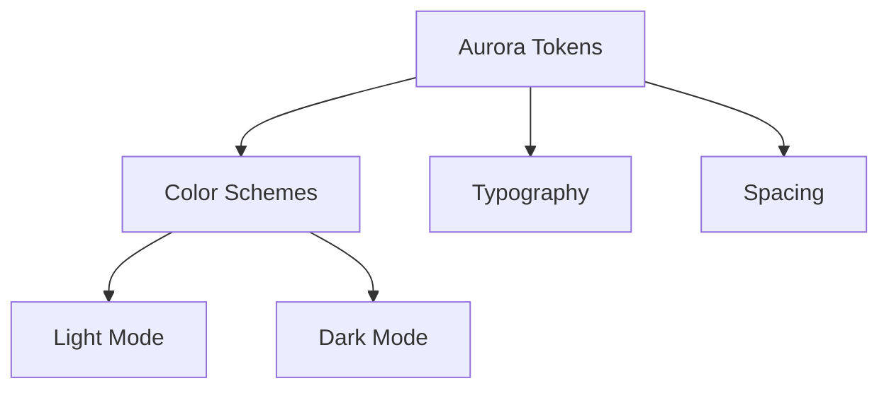

# Aurora Design System

The Braincraft presentation theme

---

# Default Layout

This slide uses the default layout with cream scheme.

<v-clicks>

- First point with progressive disclosure
- Second point appears on click
- Third point completes the story

</v-clicks>

---
layout: section
color: mint
---

# Section Divider

A fresh section with mint accent

---
layout: two-cols
---

# Two Columns

Content on the left side.

::right::

## Right Side

- Independent content
- In the right column

---
layout: center
color: lavender
---

# Centered Content

With lavender color scheme

---
layout: cover
color: slate
---

# Dark Cover Slide

Using the slate scheme for emphasis

---
layout: full
---

---
layout: center
---

# Thank You

Built with Aurora Design System + Slidev
